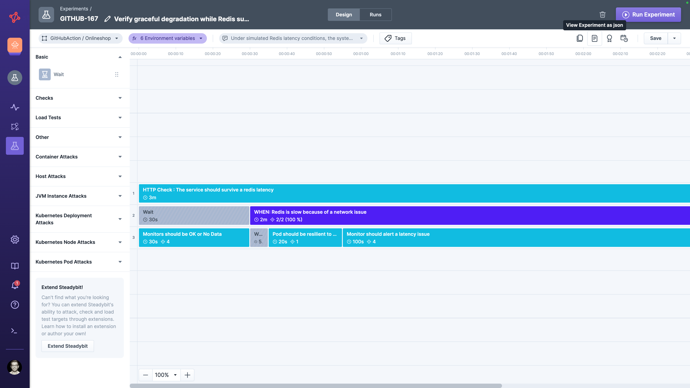
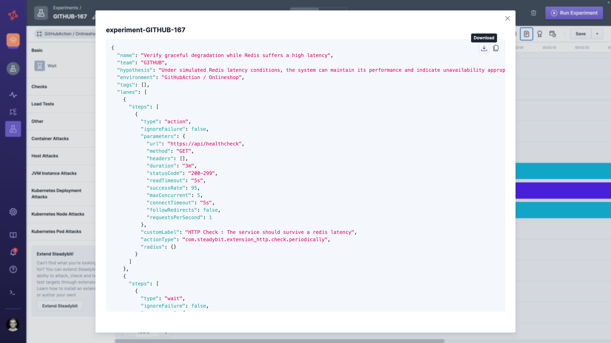
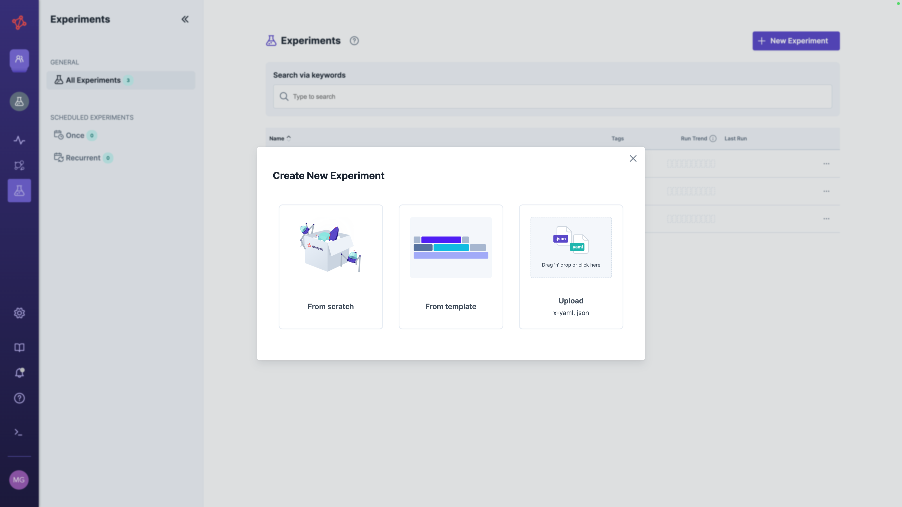

# File Import / Export

Exporting an experiment as a JSON file lets you share its design across Steadybit platforms — for example to move an experiment between on-prem instances, archive it in version control, or hand it off out-of-band.

Use this when sharing must cross a Steadybit platform boundary, or when the experiment design should live alongside other artifacts in your repository.

## How Sharing Works

Two artifacts are involved:

* **Exported JSON file** — a snapshot of the experiment's design at the moment of export, including team and environment references.
* **Imported Experiment** — a new experiment created from the file in the importing platform. Once imported, it is a regular, fully editable experiment with no link back to the original.

Because the file is a snapshot, file import/export creates a **detached copy** rather than a live link.

## Single Source of Truth

| Aspect              | Source of truth                                      |
|---------------------|------------------------------------------------------|
| Experiment instance | Per import — each import creates its own experiment  |
| Experiment design   | Detached copy at the time of export                  |
| Experiment runs     | Per imported experiment                              |

There is no propagation of design changes after import.
To apply updates, re-export and re-import — or use [Service Provided Experiments](../service-provided/README.md) for a single source of truth that propagates.

## Export an Experiment

Open the experiment in the designer and click  **View Experiment as JSON**.

A popup appears with a download button and the option to copy the JSON to your clipboard.
From there, you can edit it in the JSON editor of your choice.

## Import an Experiment

Click **New Experiment** in the experiment list and drop a JSON file onto the upload area (or click to pick one).
The file is parsed, imported, and the resulting experiment is opened in the designer.

## Flexible Team and Environment Assignment

The exporting team and environment are written into the file.
On import, the same team and environment must exist and be accessible to you.
Otherwise, you have to change the team and environment in the import-flow.

To make exported experiments portable from beginning on, replace the concrete values with variables before export:

* `{{teamKey}}` — applies the experiment to the importing user's current team
* `{{environmentName}}` — applies the experiment to that team's first environment

## When to Use This Approach

File import/export is the right choice when:

* You need to share a design across Steadybit platform instances (e.g. between on-prem tenants)
* You want to keep experiment definitions in version control alongside other code
* You plan to use the API to automate experiment creation e.g. in CI/CD
* Each receiving environment should own a fully editable, independent copy

For other sharing needs, see the [overview of sharing options](../README.md).
