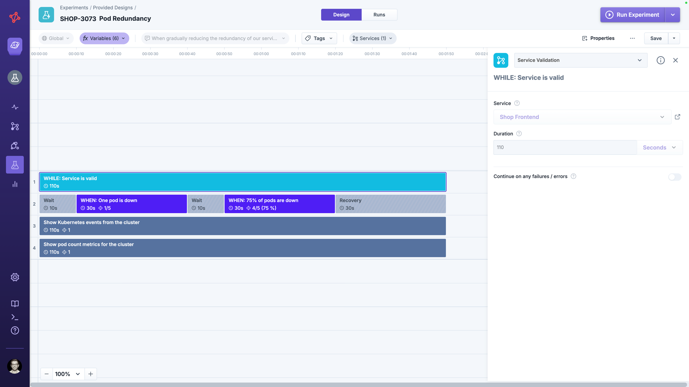

# Service Provided Experiment

A service provided experiment is the strongest form of sharing in Steadybit: the experiment design lives in a single [experiment template](../templates/README.md) and is automatically rolled out, read-only, to every [service](../../../services/README.md) whose [service profile](../../../../install-and-configure/manage-service-profiles/README.md) references it.

Use this when you want a reliability scenario — for example *Pod Redundancy* or *Loss of a Zone* — to be applied identically across many services, while keeping a single place to evolve the design.

## How Sharing Works

Three building blocks are involved:

* **Experiment Template** — the canonical experiment design. It is authored once and contains placeholders such as `[[SERVICE]]` that are filled in per service.
* **Service Profile** — groups multiple experiment templates into categories (e.g. Scalability, Redundancy, Dependencies) and defines which templates a service is expected to fulfill.
* **Service** — links to exactly one service profile and contributes its target scope and validations.

When a service is linked to a profile, Steadybit instantiates each template in the profile on-the-fly, substituting the service's targets and validations.
The result is a **provided experiment** that appears on the service detail page under *Provided Experiments*, ready to run without any manual design work.

## Single Source of Truth

| Aspect              | Source of truth                                                                        |
|---------------------|----------------------------------------------------------------------------------------|
| Experiment instance | Per service — each service has its own provided experiment generated from the template |
| Experiment design   | Controlled by the experiment template and propagates on changes                        |
| Experiment runs     | Per service — each service produces its own runs against its own targets               |

Because the design lives only in the template, every service that uses the same profile sees the same scenario, with the only difference being the service-specific targets and validations.

## Permissions

Provided experiments cannot be edited in the experiment designer. The design is owned by the template; on a service, you can only:

* Run the experiment against the service's targets
* Schedule the experiment

To change *what* the experiment does, edit the underlying experiment template.

Edits to a template are propagated automatically to every provided experiment derived from it, across all services and teams that use a profile referencing the template.
There is no per-service copy to keep in sync — fix a step or tighten a check once, and every service immediately runs the updated scenario on its next execution.

This is what sets service provided experiments apart from [duplicating an experiment](../duplicate-experiment/README.md) or [instantiating a template](../templates/README.md) into an individual experiment, where the resulting design is detached and changes have to be re-applied manually.

## Lifecycle Considerations

Because provided experiments are derived rather than copied, removing the link between template, profile and service also removes the derived experiments:


Removing a template from a service profile deletes the provided experiments and their runs for every service that uses the profile.

Changing a service's profile deletes the provided experiments and runs that are no longer part of the new profile.


Plan template and profile changes accordingly, and prefer evolving an existing template over removing and re-adding it when you want to preserve run history.

## When to Use This Approach

Service provided experiments are the right choice when:

* The same reliability scenario should apply to many services in a standardized way
* You want a single place to evolve the experiment design and have changes apply everywhere
* Each service should keep its own run history against its own targets and validations

For other sharing needs, see the [overview of sharing options](../README.md).
