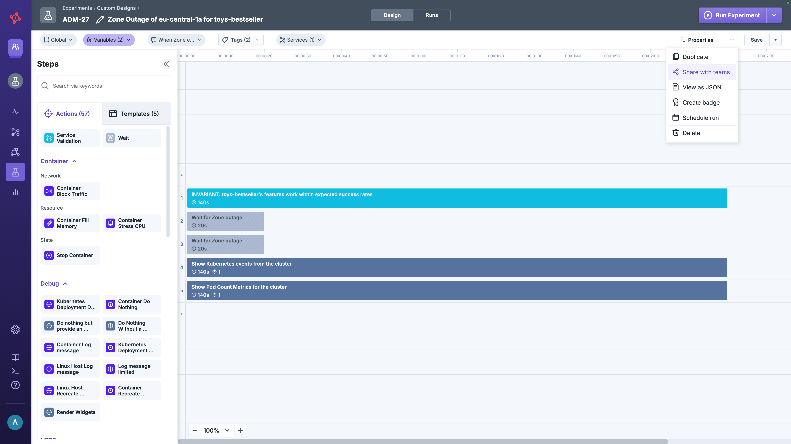
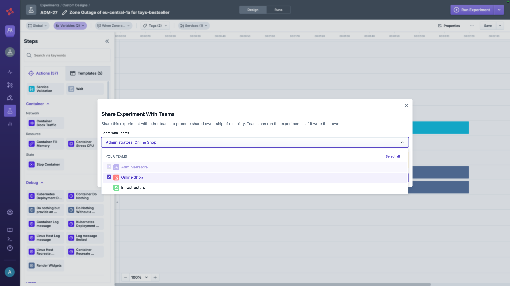
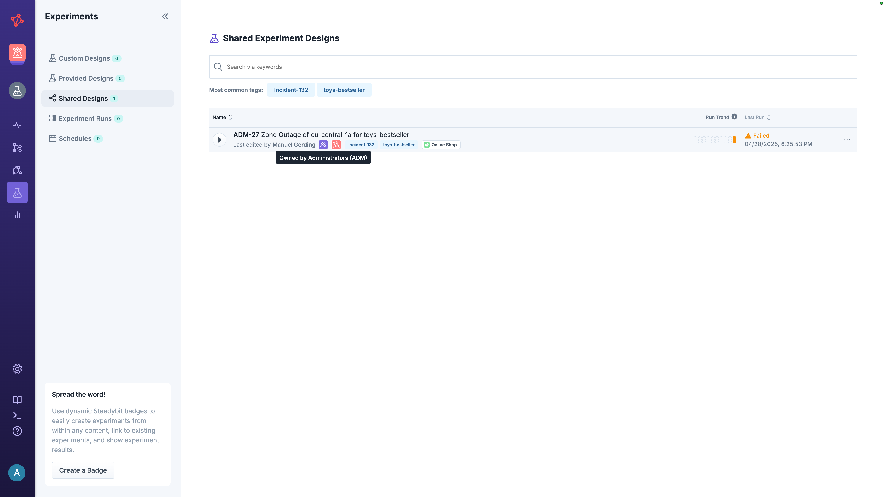

# Share Experiment Design

Sharing an experiment lets another team run an experiment owned by your team in your environment without creating a copy.
The experiment design stays in the owning team and remains the single source of truth, while the team it is shared with can run it, schedule it and adjust [per-run custom properties](../../properties/README.md).

Use this when another team should use a specific experiment as-is and the owning team must keep full control over the design.

## How Sharing Works

Two teams are involved:

* **Owning Team** — owns the experiment, controls the design, and decides which other teams it is shared with.
* **Receiving Team** — picked when sharing; gets read-only access to the design and full control over the runs.

A shared experiment is not duplicated. The receiving team sees the same instance as the owning team, just with restricted edit rights.

## Single Source of Truth

| Aspect              | Source of truth                                                                         |
|---------------------|-----------------------------------------------------------------------------------------|
| Experiment instance | The owning team's experiment (one experiment, accessible to multiple teams)             |
| Experiment design   | The owning team — only the owning team can edit the design                              |
| Experiment runs     | All runs land on the owning team's experiment, visible to every team it is shared with  |

## Permissions

Only **Administrators** and **Team Owners** can share an experiment.
See [Permissions](../../../../install-and-configure/manage-teams-and-users/permissions.md) for details.

A team that an experiment has been shared with can:

* Run the experiment
* Schedule the experiment
* [Edit custom properties of a run](../../properties/README.md)

The receiving team **cannot** edit the experiment design itself.
Any change to the design has to be done by the owning team.

## Share an Experiment

Open the experiment you want to share and select **Share with teams** in the experiment designer's context menu.
Choose the team you want to share it with and confirm.

## Find Shared Experiments

Experiments shared with your team appear in **Experiments** → **Shared Designs** and can be filtered based on the owning team.
From there you can run, schedule, or override run properties just like for your own experiments.

## When to Use This Approach

Sharing an experiment design is the right choice when:

* Another team should run a specific experiment owned by your team without duplicating it
* The experiment design must stay in one place and be controlled by the owning team

For other sharing needs, see the [overview of sharing options](../README.md).
