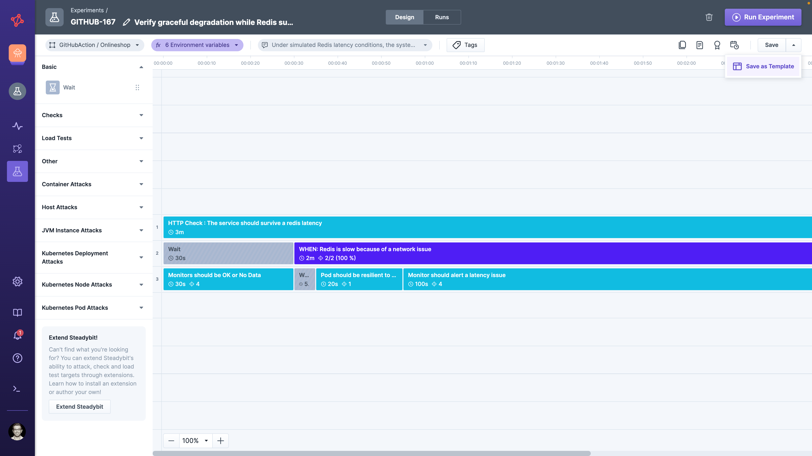
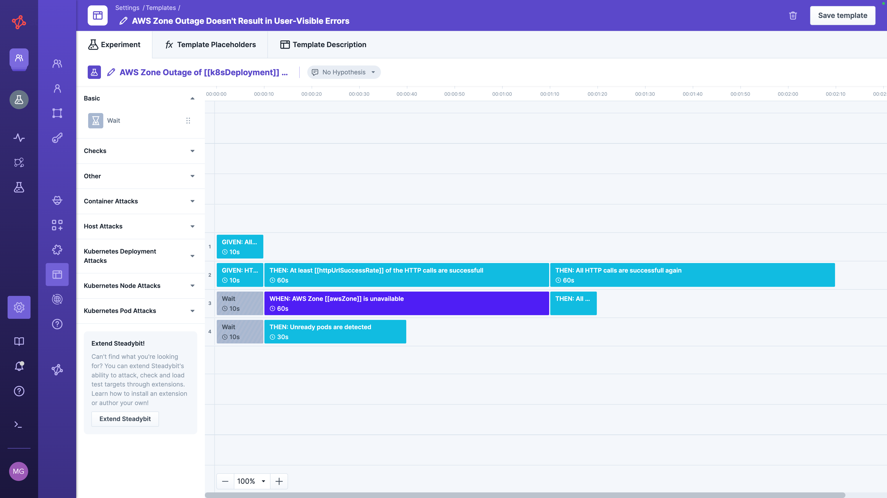
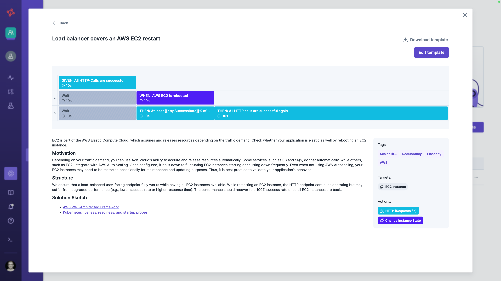

# Experiment Templates

Saving an experiment as a template makes its design available to every team in your Steadybit tenant — and optionally to the wider Chaos Engineering community via the Reliability Hub.
Each team can then instantiate the template into their own experiment, with team-specific values filled in via placeholders or environment variables.

Use this when you want a proven scenario to be a **starting point** that other teams adapt to their context, rather than a frozen experiment they run as-is.

## How Sharing Works

Two artifacts are involved:

* **Experiment Template** — the shared, reusable design. It can declare placeholders and environment variables so that team-specific values are filled in at instantiation time.
* **Instantiated Experiment** — a concrete experiment created from the template. Once instantiated, it is a regular experiment owned by the instantiating team.

Templates are tenant-wide: every team can see the catalog and instantiate any template into their own team and environment.

## Single Source of Truth

| Aspect              | Source of truth                                                   |
|---------------------|-------------------------------------------------------------------|
| Experiment instance | Per instantiation — one new experiment per team                   |
| Experiment design   | Initially the template; once instantiated, the design is detached |
| Experiment runs     | Per instantiated experiment                                       |


Template changes are **not** propagated to experiments that were already instantiated from it.
For a single source of truth that propagates updates, use [Service Provided Experiments](../service-provided/README.md) instead.


## Who Can Share

Saving an experiment as a template requires **administrator** permission.
See [Permissions](../../../../install-and-configure/manage-teams-and-users/permissions.md) for details.

## Save Experiment as Template

Open the experiment you want to share and select **Save as Template** in the save-split button.

The experiment is opened in the experiment template's editor.
Here, you must at minimum fill out the template description (title and details).
It is also advisable to replace concrete parameters with [template placeholders](../../../../install-and-configure/manage-experiment-templates/README.md) or environment variables, so other teams can adapt the experiment to their own context.

Once you're done, save the experiment template.

## Find and Use Templates

### Within Your Steadybit Tenant

All experiment templates are automatically available to every team in your Steadybit tenant.
Each team can instantiate a template into a concrete experiment owned by their team and bound to their environment.
You can also share deep links to a template's details page.

### Sharing With the Community

You can publish valuable templates to the Chaos Engineering community via Steadybit's [Reliability Hub](https://hub.steadybit.com/).
Read more in the [manage experiment template section](../../../../install-and-configure/manage-experiment-templates/README.md#share-templates).

## When to Use This Approach

Sharing an experiment as a template is the right choice when:

* Other teams should start from your design but adapt it with team-specific targets, validations, or parameters
* The instantiated experiments should evolve independently per team
* You want to publish a reliability scenario to the wider community via the Reliability Hub
* You want to prepare for a [Service Provided Experiments](../service-provided/README.md)

For other sharing needs, see the [overview of sharing options](../README.md).
