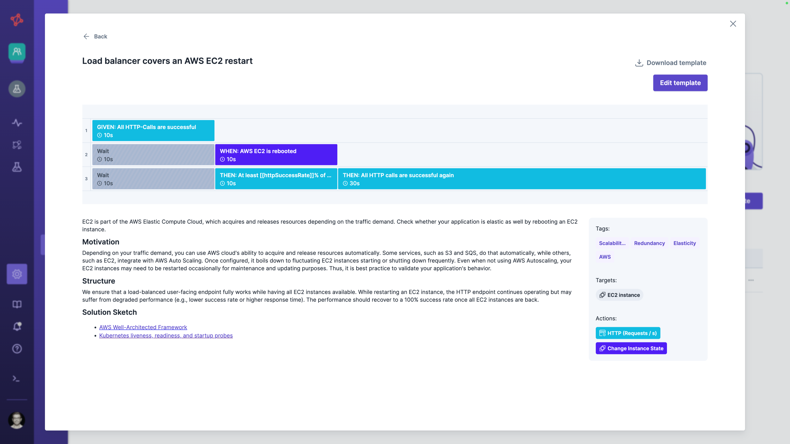

# Templates

The easiest way to share a valuable experiment within or outside your Steadybit tenant is to save it as a template.
Please note that you need administrator permission to be able to do this.

# Save Experiment as Template
Open the experiment you want to share and select 'Save as Template' in the save-split button.

The experiment is opened in the experiment template's editor.
Here, you must describe at least the template description (title and details).
But it's also advisable to replace the experiment's parameters with relevant template placeholders or environment variables.
Check out [manage experiment templates](TODO) to learn more.

Once you're done, you can save the experiment template.

# Share Templates
## Sharing within Your Steadybit Tenant
All experiment templates are automatically shared with all teams in your Steadybit tenant.
You can also share deep links to an experiment template's details page.

## Sharing with the Community
You can easily share your valuable templates with the Chaos Engineering community via Steadybit's [Reliability Hub](https://hub.steadybit.com/). Read more in the [manage experiment template section](../../../install-and-configure/manage-experiment-templates/README.md#share-templates).