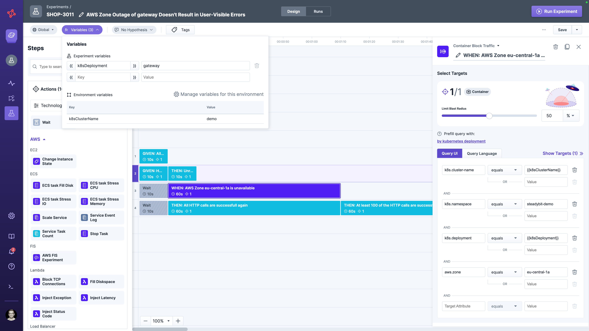

# Variables in Experiments
Steadybit supports using variables in an experiment, so you only need to define specific values once and benefit from a single source of truth.
Variables are helpful if multiple steps refer to the same configuration (e.g., in a query to define the target or the HTTP endpoint URL), see the example below, or when having multiple experiments using common infrastructure names in the experiment's definition (e.g., Kubernetes cluster name).

A variable is referenced via double curly brackets, like this: `{{variable}}`.
The variable is resolved within an experiment using different scopes, moving from inner to outer scope (see below).

## Scopes
A variable in an experiment supports different scopes to be resolved.
The innermost scope is an experiment variable, so the variable is resolved in the context of the current experiment.
This is followed by the scope of an environment variable that is linked to the currently selected environment of an experiment.

### Experiment
The innermost scope is the 'experiment' scope of a variable.
An experiment-scoped variable is only accessible from within the current experiment, and changing the variable's value only affects the current experiment.
If you have two different experiments, they can each use the same variable name but assign different values without affecting each other, as they refer to different variable definitions.

An experiment-scoped variable can shadow variables in an outer-scope (i.e., environment variable).
If that is the case, the experiment uses the value of the experiment variable instead of the environment variable.
Steadybit indicates shadowing as shown below, where the value for the `k8sClusterName` variable is defined as `docs-demo` for this specific experiment and `demo` for all other experiments using the environment `Global`.
The variable doesn't exist for experiments that aren't using the environment `Global`.

### Environment
Some values are associated with an experiment's environment and change whenever you use another environment in an experiment.
Also, once you change the variable's value, all experiments using the same environment will also use the new value.
Environment-scoped variables are the perfect place to name, e.g., common infrastructure components.
You can edit environment-scoped variables in settings -> environments.
Admins can edit all environment variables, users only variables of environments their team can access.

## Escaping
If you want to use a literal string `{{..}}` in your experiment design, you can escape it by using a single backslash like `\{{..}}`.