# Variables

Steadybit supports using variables in an experiment, so you only need to define specific values once and benefit from a single source of truth. Variables are helpful if multiple steps refer to the same configuration (e.g., in a query to define the target or the HTTP endpoint URL), see the example below, or when having multiple experiments using common infrastructure names in the experiment's definition (e.g., Kubernetes cluster name).

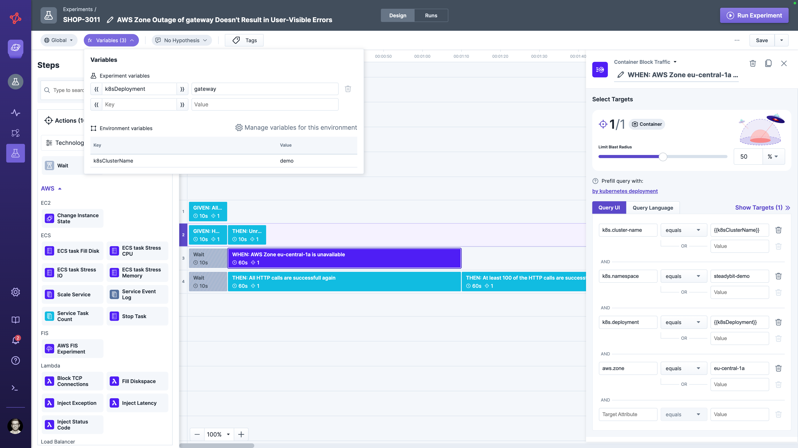

## Syntax

A variable is referenced via double curly brackets, like this: `{{variable}}`. The variable is resolved within an experiment using different scopes, moving from inner to outer scope (see below).

If you want to use a literal string `{{..}}` in your experiment design, you can escape it by using a single backslash like `\{{..}}`.

## Scopes

A variable in an experiment design / run supports different scopes to be resolved:

| Order     | Scope       | Defined on / managed in                      | Time of resolving variable                   |
| --------- | ----------- | -------------------------------------------- | -------------------------------------------- |
| outermost | Environment | An environment (Settings → Environments)     | When designing and/or running the experiment |
| ...       | Service     | A service (Service editor → Variables)       | When designing and/or running the experiment |
| ...       | Experiment  | The experiment itself                        | When designing and/or running the experiment |
| innermost | Run         | A single run or an experiment schedule       | Only when running the experiment             |

### Resolution Strategy

When a `{{variable}}` is used, Steadybit resolves it by looking through the scopes from the innermost to the outermost and uses the first definition it finds. In other words, an inner scope shadows (overrides) the same variable key defined in an outer scope.

For example, if a key `k8sClusterName` is defined both as an environment variable and as an experiment variable, the experiment uses the experiment-scoped value. Steadybit highlights such shadowing in the variables popup (see below) so you always know which value actually applies.

A variable only needs to be defined in one scope to be usable, you can, for instance, reference an environment variable in an experiment without redefining it.

### Environment

Some values are associated with an experiment's environment and change whenever you use another environment in an experiment. Also, once you change the variable's value, all experiments using the same environment will also use the new value. Environment-scoped variables are the perfect place to name, e.g., common infrastructure components. You can edit environment-scoped variables in settings -> environments. Admins can edit all environment variables, users only variables of environments their team can access.

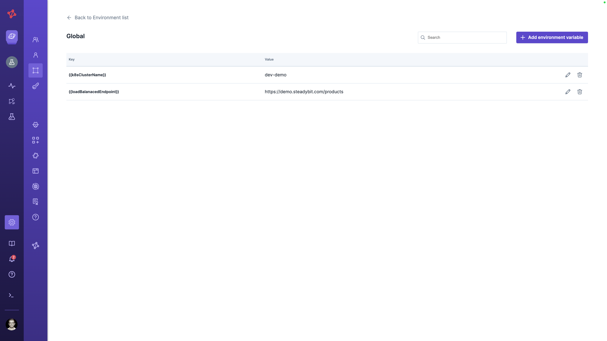

### Service

Service-scoped variables are defined on a [service](../services/README.md#variables) and apply to every experiment that uses the service, both the experiments provided by the service and custom experiments linked to it. They sit between the environment and experiment scope: a service variable extends or overrides an [environment variable](../../install-and-configure/manage-environments/README.md#environment-variables) with the same key, and can itself be overridden by an experiment variable or a run override.

Use service variables to align common configuration across all of a service's experiments, for example a service-specific base URL, namespace, or duration, without repeating it in every experiment. Service variables can also be referenced inside the service's [validation](../services/README.md#validations) definitions.

When a service variable holds a [dynamic value](#dynamic-value), you additionally choose its **evaluation scope**: whether the value is sampled from the service's own targets (the default) or from the whole environment the service lives in. See [Evaluation scope](#evaluation-scope) for details.


When an experiment is linked to **multiple services** and more than one of them defines the same variable key, the service that was associated later takes precedence.


Service variables are managed in the service editor's _Variables_ tab. [Learn more in the services section](../services/README.md#variables).

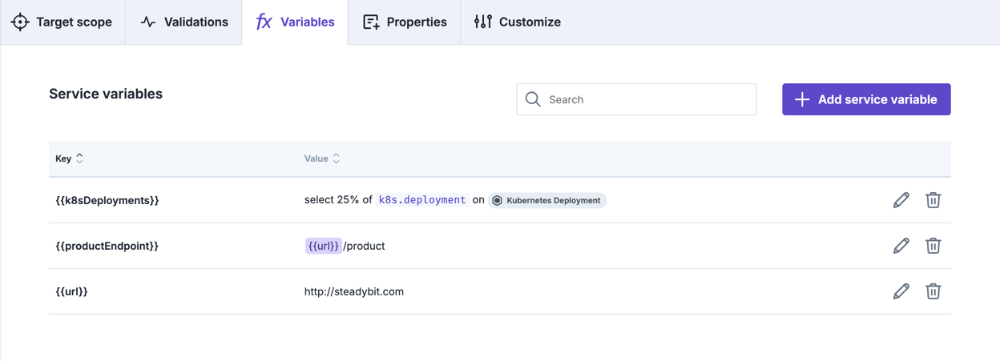

### Experiment

The next scope in an experiment design is the 'experiment' scope of a variable. An experiment-scoped variable is only accessible from within the current experiment, and changing the variable's value only affects the current experiment. If you have two different experiments, they can each use the same variable name but assign different values without affecting each other, as they refer to different variable definitions.

An experiment-scoped variable can shadow variables in an outer scope (i.e., a service or environment variable). If that is the case, the experiment uses the value of the experiment variable instead of the service or environment variable. Steadybit indicates shadowing as shown below, where the value for the `k8sClusterName` variable is defined as `docs-demo` for this specific experiment and `demo` for all other experiments using the environment `Global`. The variable doesn't exist for experiments that aren't using the environment `Global`.

### Run

For single experiment runs you can override used variables. Doing so, will apply different values, which can be defined by the user. The overrides are just applied of a single run. To do so, access the modal through the `Run Experiment` button in the editor.

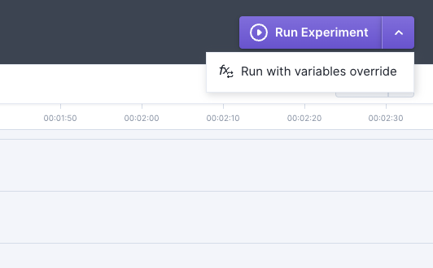

Doing so will open a modal where you can specify new values for each used variable. Experiment variable overrides will only be applied for this specific run. After the run was triggered, overrides are gone and environment/service/experiment variable values are applied again.

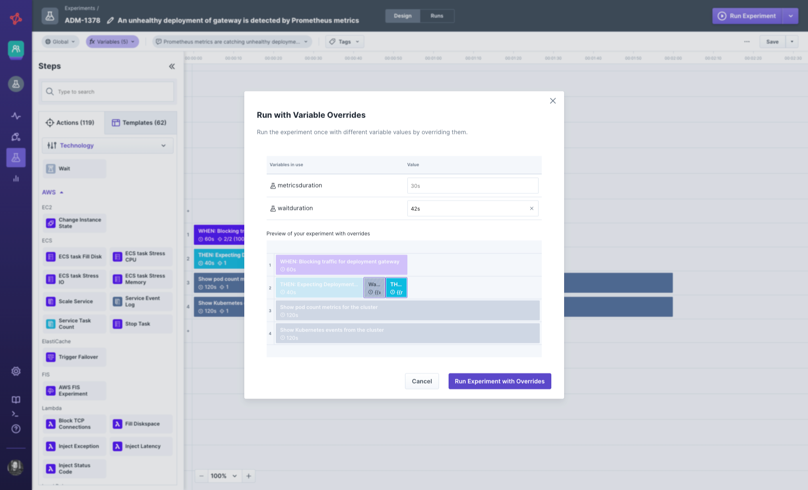

Alternatively, you can define different overrides for different experiment schedules, see [experiment schedules](schedule/)

## Value Settings

Independent of its scope, every variable (environment, service, or experiment) holds one of three kinds of value: a single **fixed value**, a **list of fixed values**, or a **dynamic value**. You choose the kind in the variable's value settings dialog, reachable via the settings icon next to the value field.

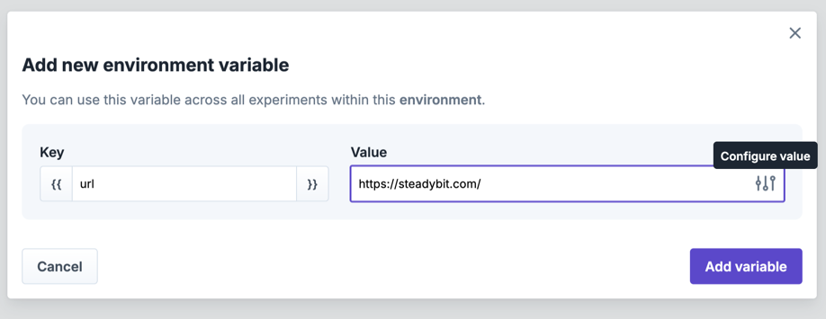

### Fixed Value

A fixed value is a constant string you type yourself. It resolves to exactly that value wherever the variable is used and is known already at design time.

Use a fixed value for stable, well-known configuration, for example a Kubernetes cluster name, an HTTP base URL, or a fixed duration like `30s`.

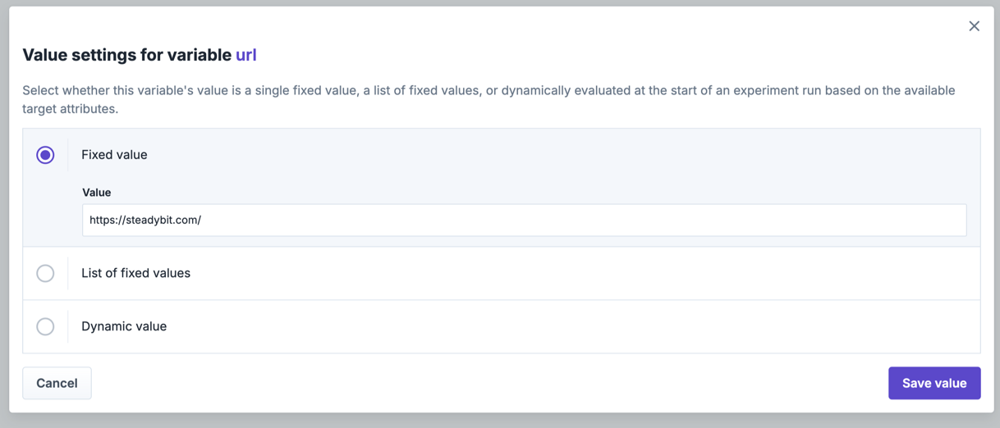

### List of Fixed Values

A variable can also hold several fixed values at once. Pick _"List of fixed values"_ in the value settings dialog and add each value as its own entry.

A list behaves like a multi-value [dynamic value](#dynamic-value), but the values are known at design time instead of being selected from your infrastructure:

- In a blast-radius query such as `... IN ({{var}})` the variable expands to one comparison value per entry, so the query matches _any_ of them. For example, a variable `{{deployments}}` with the values `gateway`, `hot-deals`, and `fashion-bestseller` used as `k8s.deployment IN ({{deployments}})` matches all three deployments.
- Where a single string is expected (for example a step parameter or a message), the entries are combined into a comma-separated list.

Add the values as separate entries rather than typing one comma-separated string, a single fixed value is always treated as one literal (so a value may itself contain commas, spaces, or other punctuation without being split).

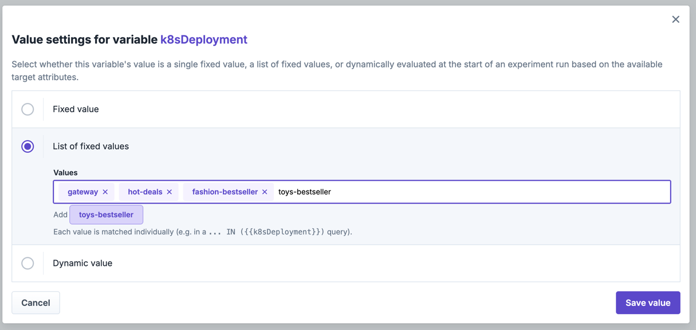

### Dynamic Value

A dynamic value is not typed by hand. Instead, it is selected from your live infrastructure when the experiment run starts. You configure it as _"select one or more values of a target attribute on a target type"_.

Use dynamic values when the specific value isn't known up front or should adapt to the current state of your infrastructure. For example, you might attack a pod that actually exists at run time rather than hard-coding a name, or vary the affected target between runs.

The configuration consists of:

- Target type — the kind of target to read the value from (e.g., a Kubernetes pod, a host, an AWS EC2 instance).
- Attribute — the target attribute whose value should be used (e.g., the pod name, host name, or an AWS instance id).
- Evaluation scope _(only for service variables)_ — whether to sample from the service's own targets or the whole environment (see [Evaluation scope](#evaluation-scope)).
- Filter _(optional)_ — a query that restricts the candidate targets before a value is picked (e.g., only pods in a certain namespace).

You also control the **cardinality** of the selection, how many of the matching values are picked: a single value or several. When more than one value is selected, the variable carries the whole set. In a blast-radius query such as `... IN ({{var}})` it expands to one comparison value per selected value; where a single string is expected, the selected values are combined into a comma-separated list.

#### Evaluation scope

For a dynamic value on a [service variable](#service), you additionally choose the **evaluation scope**, i.e. which targets the value is sampled from:

- **Only targets of this service** _(default)_ — only the service's own targets are considered: the service's environment narrowed by the service's [target query](../services/README.md#target-scope).
- **All targets of this service's environment** — all targets in the environment the service lives in are considered, ignoring the service's query.

The evaluation scope only applies to service variables. For environment, experiment, and run variables, a dynamic value is always sampled from the environment.

#### Run-time resolution

Because a dynamic value depends on the live target index, it is resolved at the start of each run (not at experiment design time). The selected value or values then stay stable for the entire experiment run, every step that references the variable uses the same selection, and the resolution happens again only on the next run. The concrete value that was selected for a given run can be inspected afterward in the [resolved variables](#resolved-variables-in-experiment-run) view.

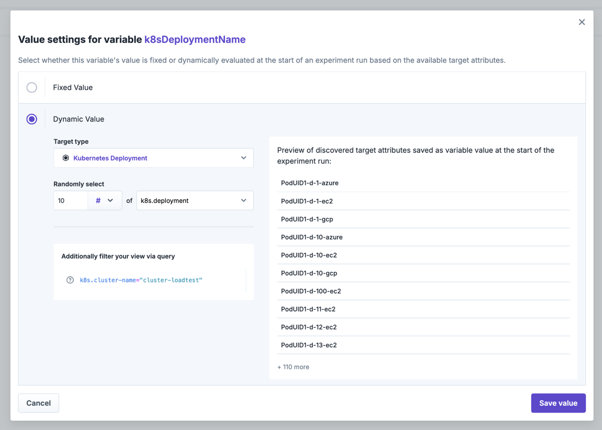


A dynamic value resolves to a value from the target index. If, at run time, no target matches the configured type and filter, the variable cannot be resolved and the experiment run will report the unresolved variable.


#### Sample Values in Experiment Editor

Because a dynamic value is only resolved for real when a run starts, the concrete values it will take are not known while you design the experiment.
To give you a meaningful preview, Steadybit draws **one sample** of the matching values, when you open the experiment, when you change the environment, and whenever you create or edit a dynamic value, and uses that same sample everywhere in the editor.
As a result the target counts per step, the _show targets_ list, and the sampled values shown beneath each dynamic variable all agree with one another, instead of changing every time a preview is recalculated.

The sampled values are shown directly under the variable's definition in the variables popup:

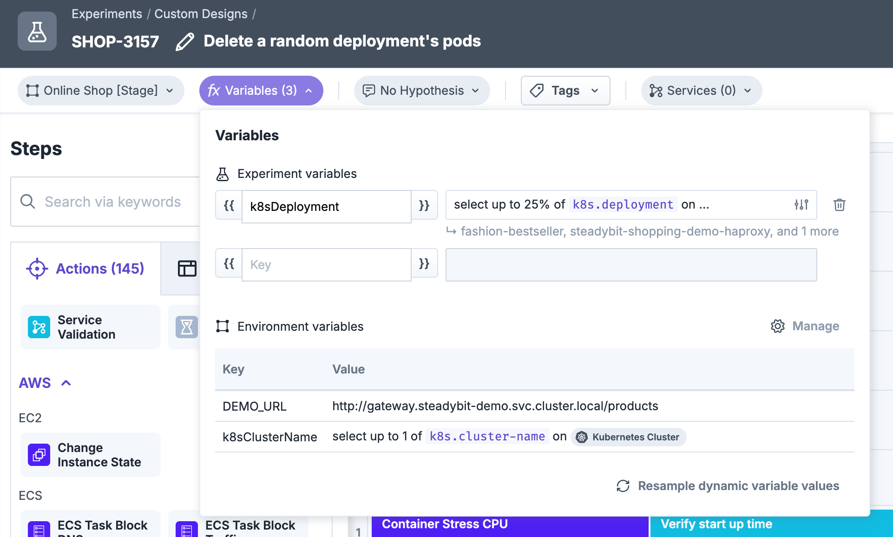

This sample is only a design-time preview, it is never saved with the experiment.
To draw a fresh sample at any time, use **Resample dynamic variable values** in the variables popup.
Editing a dynamic value re-samples only that variable, so the sampled values for the other variables stay stable.

Each run still selects its values independently when it starts (see above), so the preview shows a representative selection, not necessarily the values a future run will use, unless you deliberately run with the previewed sample (see [Run with sample values](#run-with-sample-values)).

#### Run with Sample Values

The primary _Run Experiment_ button lets each run pick its own dynamic values at start.
If you instead want to run the experiment with exactly the sample values in the editor, open the split button next to _Run Experiment_ and choose **Run with sample values**.

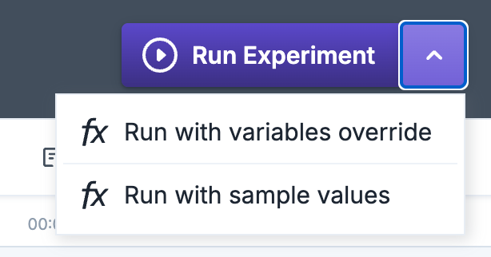

A dialog lists the dynamic variables in use together with their current sample values and starts a single run pinned to exactly those values.
You can draw a fresh sample from within the dialog before running.

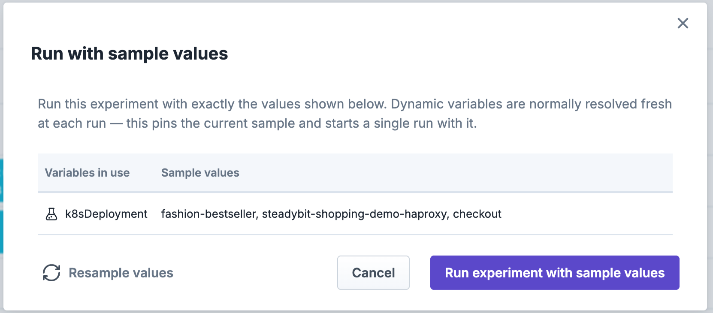

## Referencing Other Variables

Variables can be built from other variables using the same `{{...}}` syntax, so you can compose values from reusable building blocks instead of repeating them:

- A **fixed value** can embed other variables. For example, a `baseUrl` variable defined as `https://{{host}}/api` reuses a `host` variable.
- The **filter query of a dynamic value** can reference other variables. For example, a filter `k8s.namespace="{{namespace}}"` scopes the candidate targets to whatever the `namespace` variable resolves to.

Referenced variables are resolved with the same [resolution strategy](#resolution-strategy) and scope rules as everywhere else, a reference can point to a variable from any scope (environment, service, experiment, or a run override).


References must ultimately resolve to a concrete value. Avoid circular references (a variable that refers back to itself, directly or through another variable),they cannot be resolved and the experiment run will fail.


## Resolved Variables in Experiment Run

In case you want to check which variables have been used for a single experiment run, you can check this in the experiment run view by clicking `See used variables` on the top section. The icon on the variable key tells you about the scope of the used variable (environment, service, experiment, or run override). For dynamic values, this view shows the concrete value that was selected for that specific run.

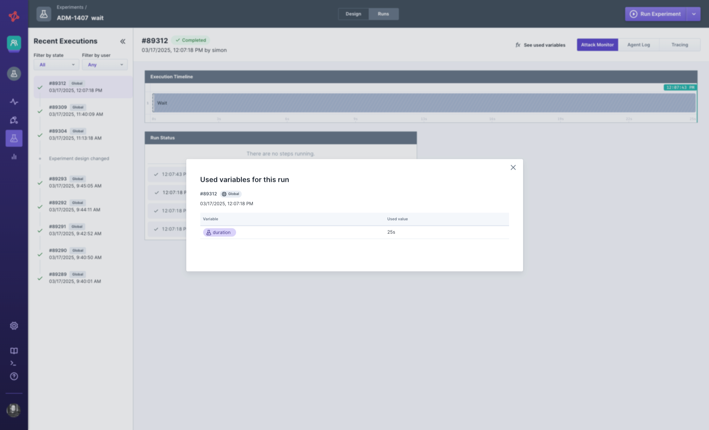
