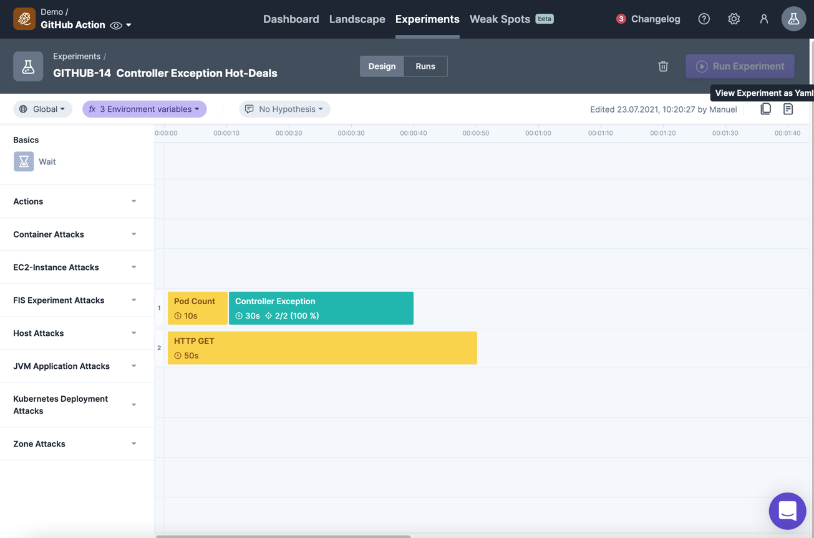
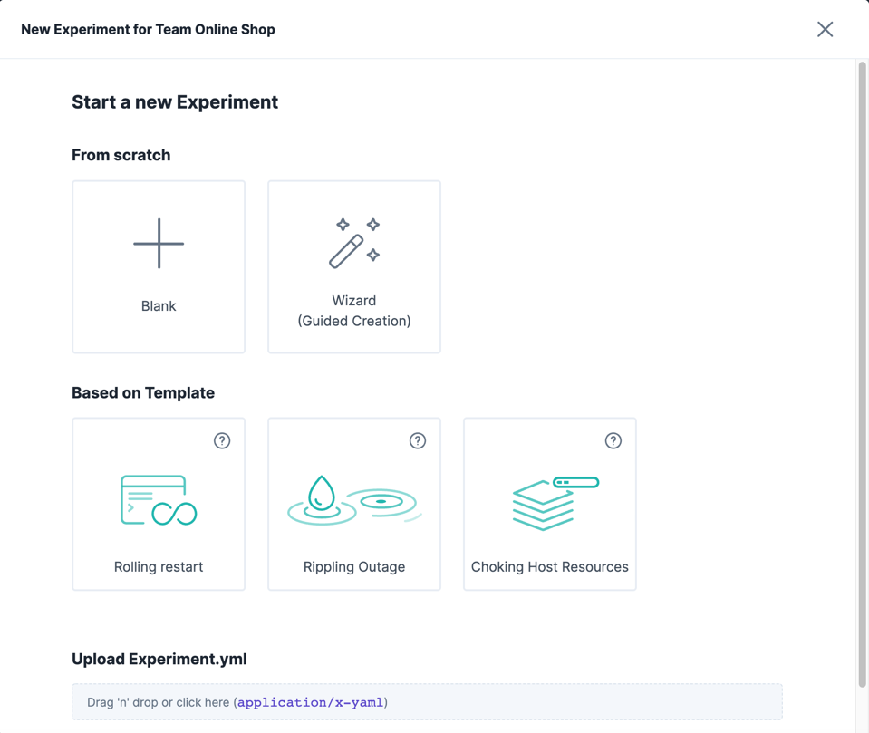

## Experiment export/import via YML

### Experiment export via YAML

When you edit your experiment in the designer, you can export it to a YML file.
For that please click on the button  `View Experiment as Yaml`.

Then you see a popup with a download button and you are able to copy it to your clipboard.

So you are able to edit your experiment in the YML editor of your choice.

### Experiment import via YAML

When you want to import an experiment, you can do it via the `New Experiment` button in the experiment list.

Then you can drag and drop the YML file onto the upload area or click on it to select a file.
This file will then be parsed and the experiment will be imported and opened.