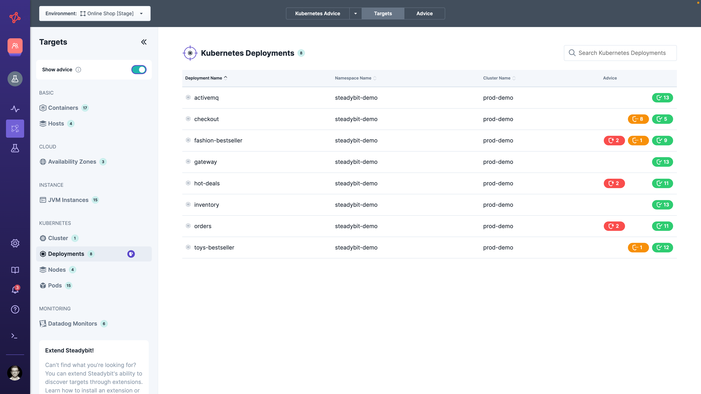
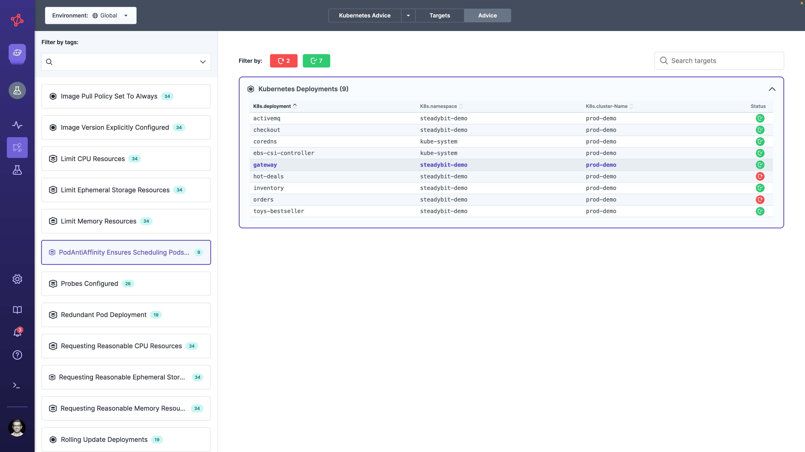

# Advice
Steadybit helps you on your Chaos Engineering journey to a reliable system by providing best practices applied to your system as advice.
Advice checks whether your infrastructure configuration is appropriate and, if so, suggests, e.g., Chaos Engineering experiments to validate that your reliability mechanisms actually work.
In addition, advice is fully extensible to allow you to add more best practices or customize existing ones.

## Advice Lifecycle
Advice apply to a single target of a particular target type and is in one of the following states:

-  Action Needed
-  Validation Needed
-  Implemented

Advice may not support and skip a particular state depending on its definition.

### 1. Action Needed
The advice has automatically discovered that your target's configuration requires changes to follow best practices. For instance, advising you to address redundancy configuration for Kubernetes deployments or deploying your application in multiple cloud vendor's availability zones.
The advice summarizes the matter, gives additional motivation to explain why you should address it, and gives specific instructions to improve it.


As soon as you implement the suggested instruction, Steadybit automatically discovers the change and - depending on the advice definition - asks you to validate your changes (lifecycle 'Validation Needed') or marks the advice as 'Implemented'.

### 2. Validation Needed
The advice has discovered that your target's configuration follows best practices but recommends to validate that they are actually working. Validation can't be performed automatically by Steadybit and always requires human interaction.
Supported validations are:

- Experiments: The advice suggests an experiment you should run to validate whether the target's configuration is working.
- Text: The advice gives additional context for manually checking whether the target's configuration works.


To perform the validation, we suggest you do the corresponding action (run an experiment or follow the text-based instruction) and mark the validation as done.
When you've performed all validations, the advice's states go into the end state ('Implemented').


### 3. Implemented
Great job!
You followed the advice and have fulfilled all required actions and validations.


In case you invalidate one of the validations or the discovery detects a required configuration change, the advice will return to the 'Validation Needed' or 'Action Needed' state.

## Following Advice
You can see given pieces of advice in the Steadybit Explorer.
The Explorer Landscape and Explorer Targets show you advice in a target-first manner, showing all advice for a given target.
The Explorer Advice lists all available advice and its applicable targets.

### Landscape
Once you activate the 'Show Advice' in the sidebar, the targets are colored depending on the worst advice state (see [Advice Lifecycle](#advice-lifecycle)). You can see more details for each target by opening up the target sidebar or target details.


### Targets Table
Once you activate the 'Show Advice' in the sidebar, the general advice icon indicates target types having advice.
You can see the advice per target in the table and details about each advice in the target details.



### Advice
In the Explorer Advice, you can see all supported advice, followed by the applicable targets and the respective status.
It's the perfect place if you want to resolve the same advice for multiple targets.
You can also filter based on advice's status to concentrate, e.g., first on targets requiring action for a specific advice.




## Query Language
Steadybit's [Query Language](/concepts/query-language) fully supports advice to guide you on the Chaos Engineering journey.
You can, e.g., filter targets in the Landscape and Experiments, or size targets in the Landscape by using the following attributes:

- `advice.applicable` provides a set of advice definition ids that apply to the target, no matter in which lifecycle state.
- `advice.status.action-needed` contains for a given target all advice in the lifecycle state 'Action Needed'
- `advice.status.validation-needed` contains for a given target all advice in the lifecycle state 'Validation Needed'
- `advice.status.implemented` contains for a given target all advice in the lifecycle state 'Implemented'

Based on these attributes you can build queries like:

#### Example 1: Show all targets that need action for a specific advice
```
advice.status.action-needed ="com.steadybit.extension_kubernetes.advice.single-aws-zone"
```

#### Example 2: Show all targets that require at least one validation for any advice
```
count(advice.status.validation-needed) > 0
```

#### Example 3: Show all targets where advice is applicable
```
advice.applicable="com.steadybit.extension_kubernetes.advice.k8s-host-podantiaffinity"
```

## Supported Advice
We support various advice for, e.g., Kubernetes or public clouds and are constantly adding more.
Check out the [Reliability Hub / Advice](https://hub.steadybit.com/advice) for our current support.

## Extending Advice
Advice capability is developed using the open-source [AdviceKit](https://github.com/steadybit/advice-kit), allowing you to contribute your advice or fork existing ones. You can also always check out the code of existing advice in the [Reliability Hub](https://hub.steadybit.com/advice) and its corresponding GitHub repositories.