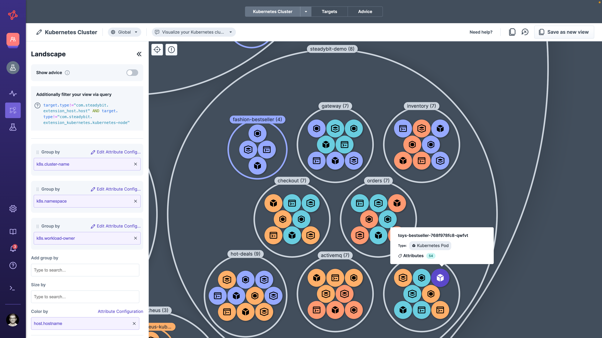
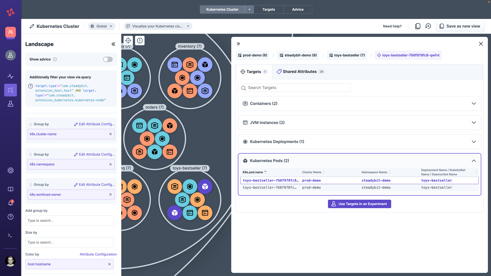
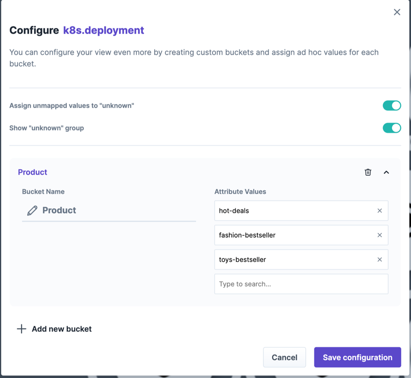
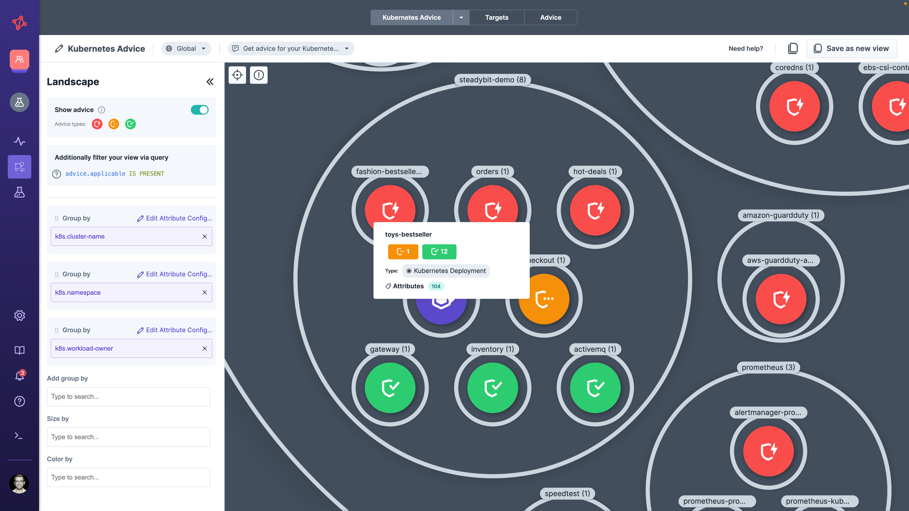
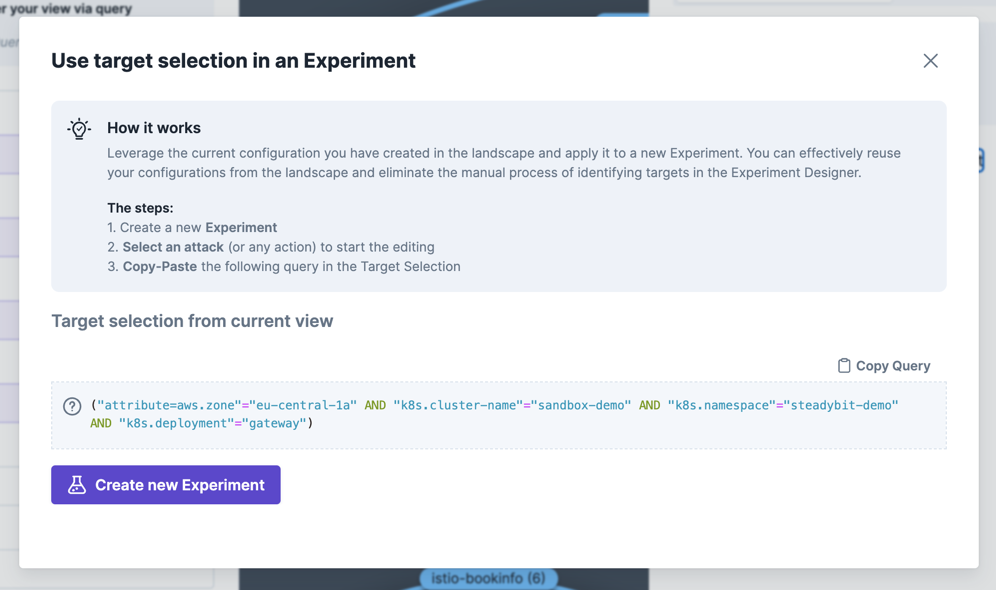
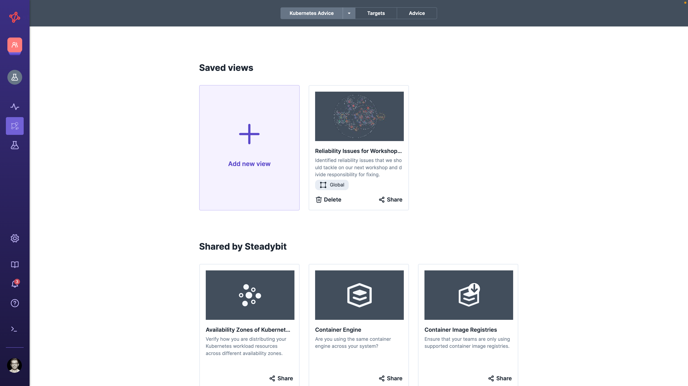

# Landscape

The Landscape informs your Chaos Engineering journey by letting you analyze the discovered infrastructure components in more detail. You can navigate through potential targets to, for example, look for new experiments to approach a team with, or check whether other components may be affected by a reliability issue you have found.

## Drill-Down Targets

When using the Landscape, you have the following capabilities at hand to better understand discovered targets:

* **Environment** to define the maximum set of targets you would like to explore
* **Filter targets via Query** to include targets you are interested in and exclude all targets that do not match
* **Group by** to group targets by an attribute value and bring them next to each other. You can nest subgroups as deeply as you like.
* **Size by** to size targets according to how many distinct values one of their attributes has
* **Color by** to highlight and differentiate attribute values

For every target or group of targets, you can view the discovered target types and attributes.

### Attribute Configuration

For 'grouping by' an attribute, you can additionally configure:

* **Show "unknown" group** controls whether a target that doesn't have a value for the chosen attribute (e.g., `k8s.deployment`) is added to the `unknown` group. If deactivated, the target will be hidden. Otherwise, you see an additional `unknown` group.
* **Assign unmapped values to "unknown"** controls whether a target's attribute value that isn't assigned to a bucket (see below) is added to that same "unknown" group, or kept as its own group.
* **Buckets** allow you to group multiple target attribute values into one. For instance, grouping deployments named `hot-deals`, `fashion-bestseller`, and `toys-bestseller` into the bucket `products` shows them in the grouping as if all three deployments were named `products`.

Buckets are also available in the attribute configuration of 'color by'.

## Advice

Once you activate the 'Show Advice' in the sidebar, the targets are colored depending on the worst advice state (see [Advice Lifecycle](advice.md#advice-lifecycle)). You can see more details for each target by opening up the target sidebar or target details.

Learn more about [advice](advice.md) in the corresponding section.

## Create Experiments

Once you have identified a relevant group of targets for an experiment, you can click on that group and choose to use the target selection for an experiment. The Landscape provides the exact query so that you can copy it into an experiment design.

## Saved Views

You can save all views you have created with the Landscape to share them automatically with your team members. In addition, you can always share a view with someone else using a deep link to that particular view. Whenever you have made changes to a saved view, the Landscape asks whether you want to keep them in that view or save them as a new one.

In addition, Steadybit shares some predefined views that will help you to get started with the Landscape. They depend on the targets actually discovered, showing a Kubernetes map only when at least one Kubernetes cluster is discovered.

