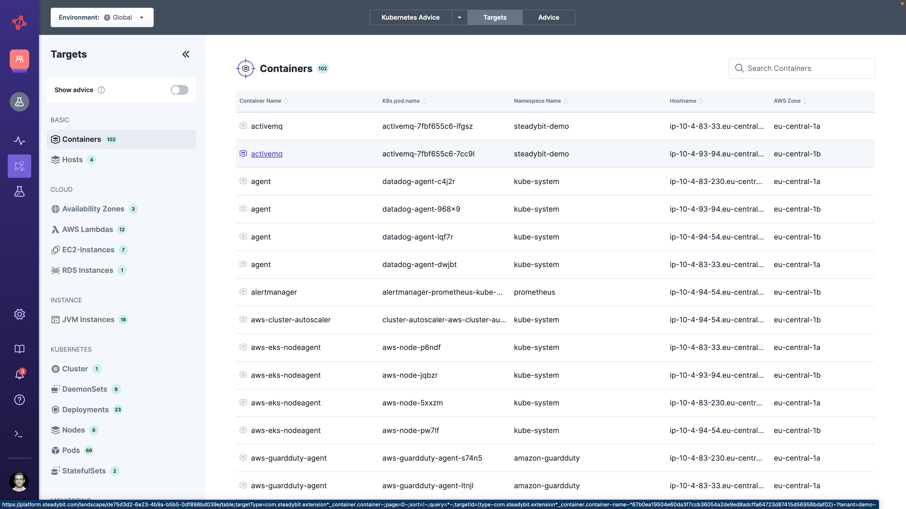
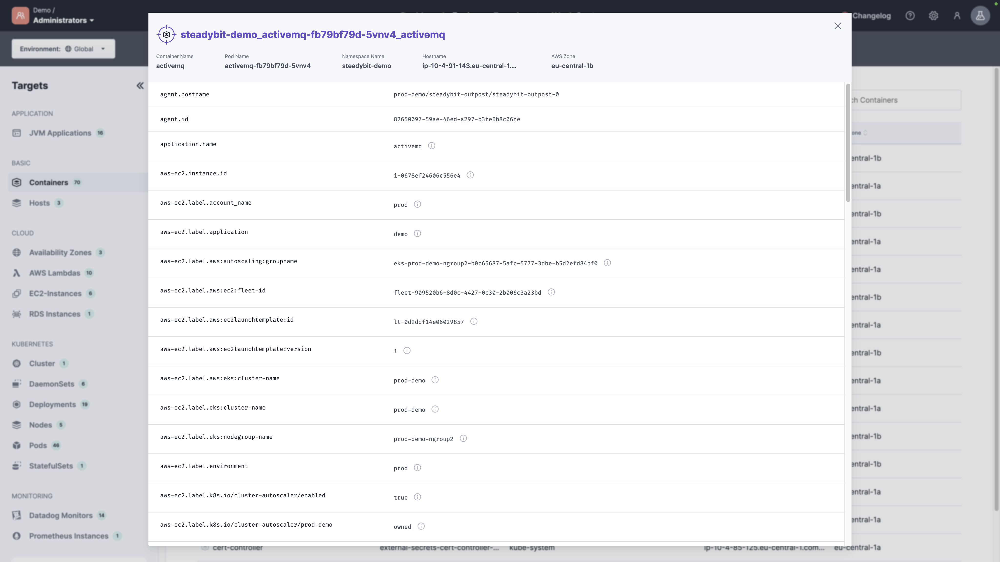
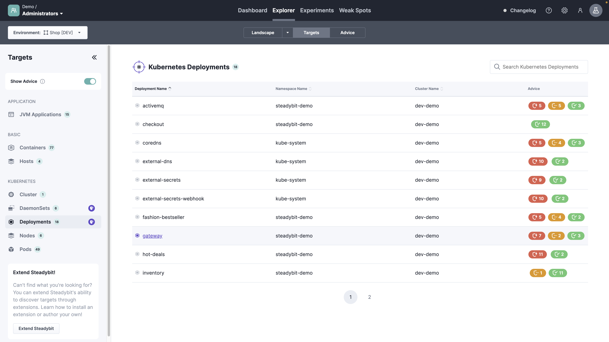

# Explorer Targets

## Table View

The explorer target table gives you an overview of all targets to check, e.g., for completeness of targets or whether a newly installed extension discovers the appropriate target type.
You can always see the full details of a target by clicking on it.
Depending on your team's permission, you can see the environment Global to see all discovered targets or choose a specific environment to list targets according to your permissions.

## Advice
Once you activate the 'Show Advice' in the sidebar, the general advice icon indicates target types having advice.
You can see the advice per target in the table and details about each advice in the target details.

Learn more about [advice](/use-steadybit/explorer/advice) in the corresponding section.

