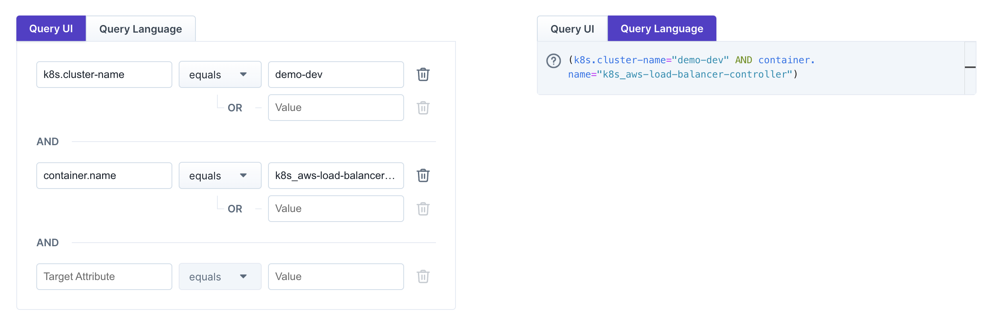

# Query Language

### What is the Query Language?

There are some use cases, where you want to restrict the targets discovered by Steadybit. One use case can be that you want to [design an experiment](experiments/design.md#basic-elements) and make sure, that there are only targets of a specific Kubernetes cluster affected by the experiment. Another use case is that you want to restrict the available targets when [configuring an environment](../install-and-configure/manage-environments/#advanced-environments).

Boiling down to a set of targets can result in complex statements. For instance, you want to make sure that the targets are matching some sets of key-value pairs but also not in your production cluster. Expressions like these can now easily be written in Steadybits Query Language. The Query Language is a textual representation of the Query UI but with a more advanced feature set. It allows you to build semantic expression blocks, combining them with other expressions or negating them. The Query UI and the Query Language always come together, so it is up to you to choose the style.

### How to switch between the Query UI and the Query Langauge

<figure><figcaption><p>The same query can be expressed with the Query UI on the left and the Query Language on the right</p></figcaption></figure>

When introducing the Query Language, we added a new tab to the already known query UI. Clicking it will switch the edit mode to the Query Language. The already configured query will be translated into the textual form and rendered within the text editor. You can just go ahead writing your own query expressions in there. Like the Query UI, the editor will provide you with auto-completion on available keys and values.&#x20;

Please note that the Query UI is limited in regard to the queries you write. For instance, one cannot express a query like `(a="b" AND d="e") OR f="g"` with the Query UI. The interface will tell you when the query can only be edited with the language editor.&#x20;

<figure><figcaption><p>Complex queries can only be edited in the Query language editor.</p></figcaption></figure>

### Query Examples

#### Key-value comparison

Keys and values can be compared using `=`, `!=`, `\~`, and `!\~`.

```
// Simple equals check to get all targets of Kubernetes Cluster 'prod'
k8s.cluster-name="prod"

// Not equals check to get all targets not running in the Kuberneters Cluster 'prod'
k8s.cluster-name!="prod"

// Get all targets with a container name that contains "hot-deals"
k8s.container.name~"hot-deals"

// Query for all container targets whose maintainer does not contain Jane
container.label.maintainer!~"Jane"
```

You can also check for the presence or absence of a certain key using `IS PRESENT` and `IS NOT PRESENT`.

```
// Cluster-name is set, so getting all targets running in a Kubernetes cluster
k8s.cluster-name IS PRESENT

// Kubernetes label service-tier isn't set on a target
k8s.label.service-tier IS NOT PRESENT
```

#### Aggregations

To aggregate a key's value, you can use the `COUNT` function to check for the number of distinct values with numeric operators like `<`,`<=`,`=`,`>=` and `>`.

```
// Only find targets running in at least two AWS availability zones   
COUNT(aws.zone) >= 2

// Only find targets running just a single pod replica   
COUNT(k8s.pod.name) = 1
```

#### Expression Concatenation

Simple expressions can be chained with AND & OR.

```
// Get all targets of Kubernetes cluster "prod" or "staging"
k8s.cluster-name="prod" OR k8s.cluster-name="staging"

// Get all targets of Kubernetes cluster "prod" running on the host "ip-1-2-3-4"
k8s.cluster-name="prod" AND host.hostname="ip-1-2-3-4"
```

#### Expression Negation

You can negate a specific key-value expression using NOT.

```
// Matches all, but not prod
NOT k8s.cluster-name="prod"
```

#### Parenthesis

Expression blocks can be encapsulated using parenthesis.

```
(k8s.cluster-name="prod" OR k8s.cluster-name="staging") AND aws.zone="eu-central-1b"
```

#### Quoting Special Characters

Keys containing special characters like `:` and `/` needs to be quoted to work properly.

```
// Quoting keys with special characters is necessary
"label.aws:ec2launchtemplate/version"="some value"
```
