# Reporting

Steadybit's integrated reporting feature gives you a comprehensive overview of your service reliability risk, your experiment activity, and your adoption of Steadybit across users, teams and environments.
Use it to track progress over time, share evidence with stakeholders, and spot regressions across your infrastructure.

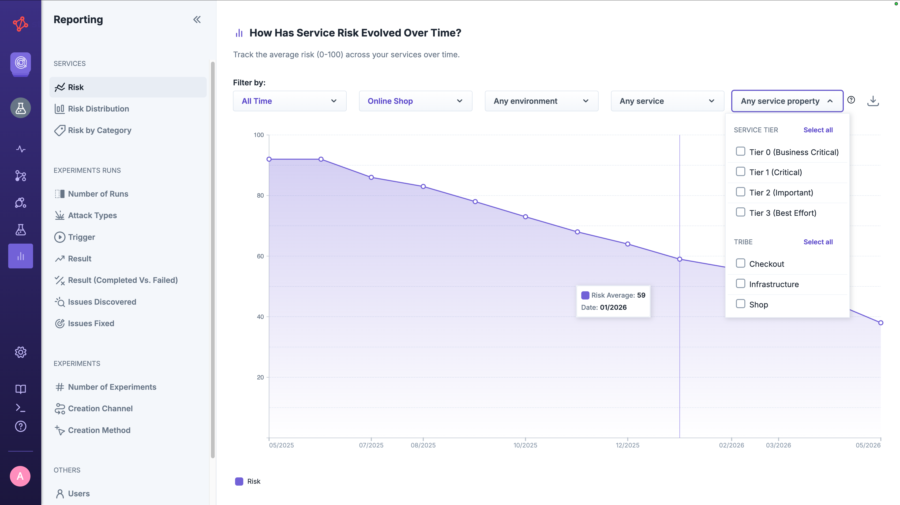

You can filter the reports based on different dimensions (e.g. service, team, environment, service) or use the legend's labels below any report to filter the data shown in the graphs.

All charts can be downloaded as CSV, PNG or PDF.

## Service Risk

The **Service Risk** reports answer questions like how risky are services on average, how are they distributed across risk levels, and which reliability categories are driving the risk.
[Learn more about Steadybit's service risk](../services/README.md#risk).

Each report writes a fresh data point per service whenever the service's risk changes, or — at the latest — once per day.
This means your historical timeline always reflects the property values that were in effect at the time.

You can filter Service Risk reports by 
* Timeframe
* Teams
* Environments
* Services
* Service Properties (enum-typed [custom properties](../experiments/properties/README.md)).

This allows to focus on services being tagged, e.g., with `Tier 0 - Mission Critical` and drill down on [reliability categories](../../install-and-configure/manage-service-profiles/README.md#categories) like 'Scalability'.

### Average Risk Over Time

Track the rolling average risk across your services.
Useful as a single-pane health number to share with stakeholders or to spot regressions when new services are onboarded or a service profile changes.

### Risk Distribution

See how many of your services fall into the low, medium and high risk levels.
Easy to share with stakeholders the value of your reliability work by showing trending of services into low risk levels.

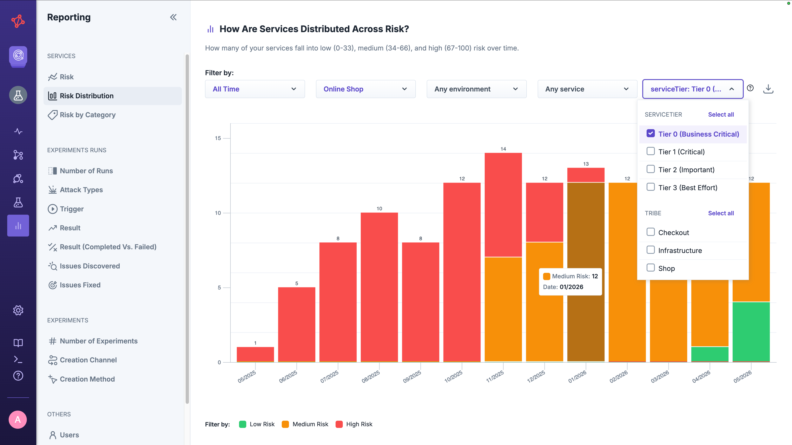

### Risk by Category

Break down the average risk per reliability category (e.g. Redundancy, Scalability, Dependencies) merged globally across all service profiles.
Use this to identify which dimensions of reliability need the most investment across your services — independent of which service profile a service uses.

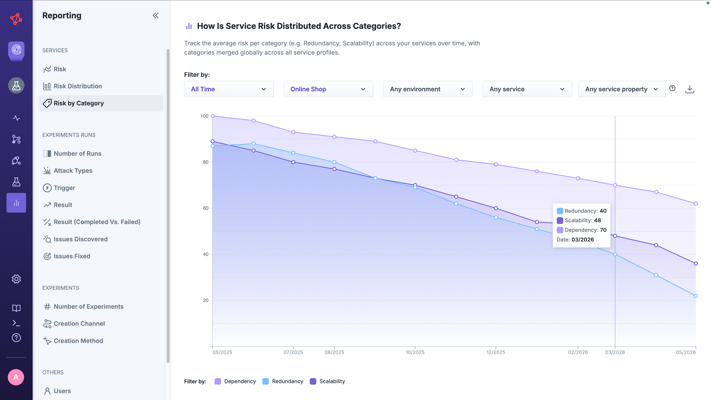

## Experiment Runs

The Experiment Runs report gives you an overview of all experiment runs that have been executed — including their outcomes, what triggers them, and how they move between completed and failed over time.
Use it to make experiment activity visible across teams and to spot when chaos coverage starts to drift.

You can filter the reports by the following criteria:

* Timeframe
* Teams
* Environments
* Services

### Number of Runs

Find out how many experiments your teams have run in total.

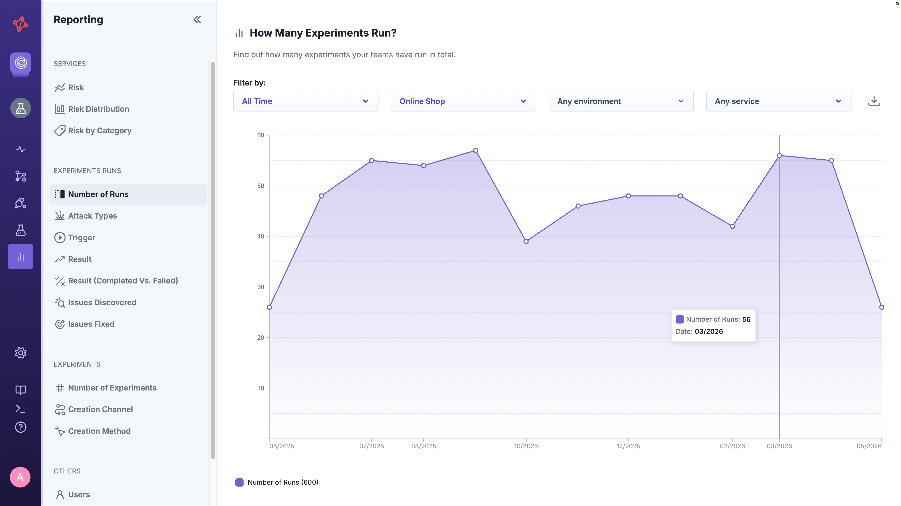

### Attack Types

Identify which attacks your teams have used most frequently.

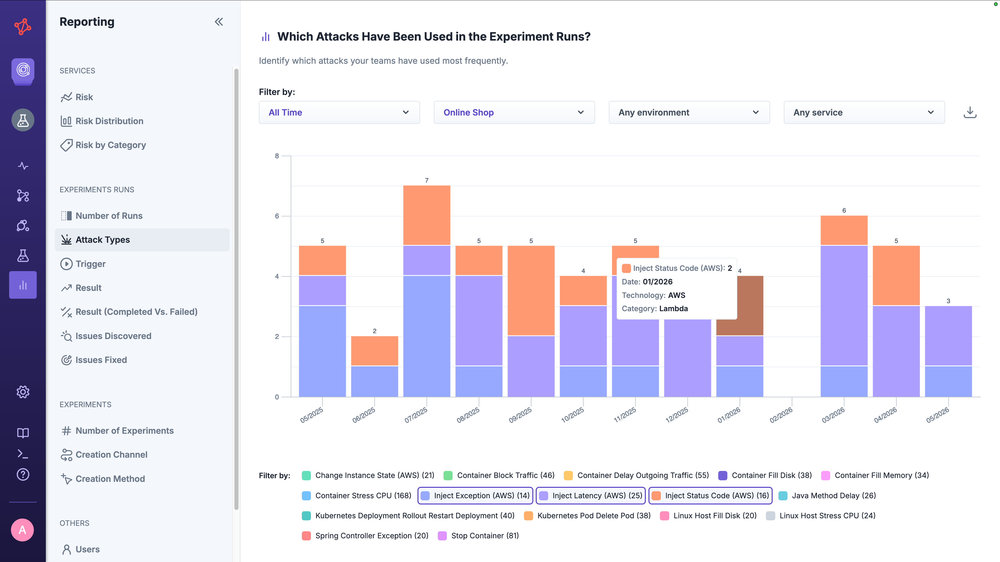

### Trigger

Check out what typically triggers an experiment run, e.g., API, CLI, UI, or schedule.

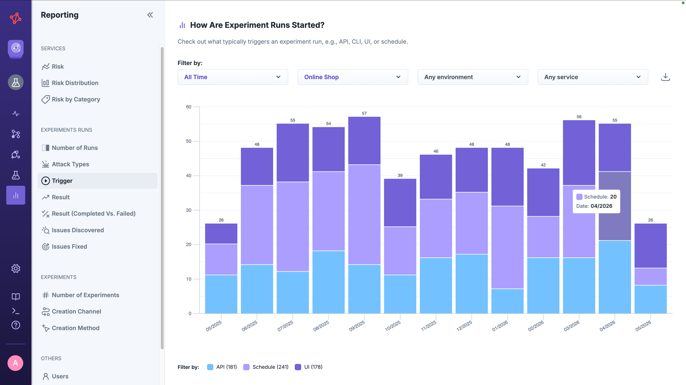

### Result

Drill down into the experiment runs by the result and compare the numbers of completed, canceled, failed, and errored experiment runs.

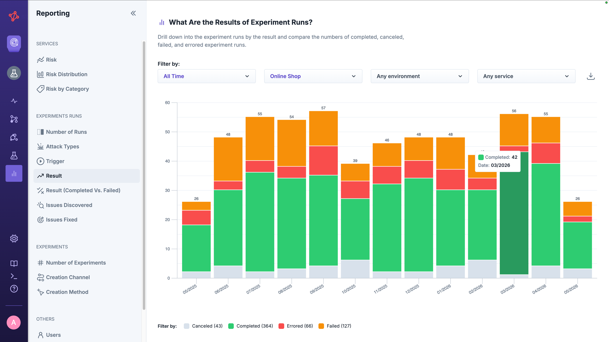

### Result (Completed vs. Failed)

Compare the portion of completed experiment runs to failed experiment runs to identify the frequency of identifying issues.

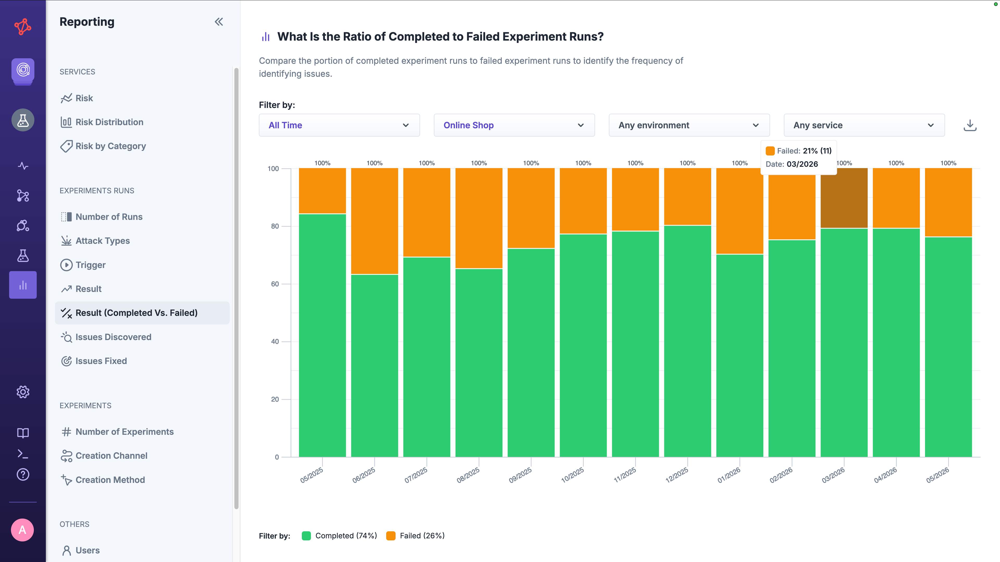

### Issues Discovered

Identify how many experiment runs turned from completed to failed. We count experiment failures that were immediately preceded by a completed experiment run.

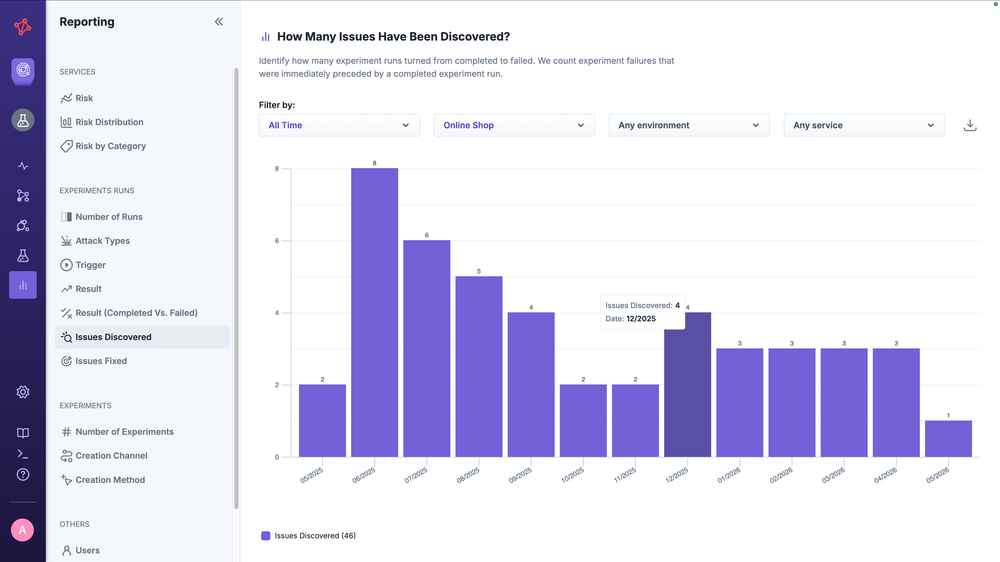

### Issues Fixed

Identify how many experiment runs turned from failed to completed. We count experiment runs completed that were immediately preceded by a failed experiment run.

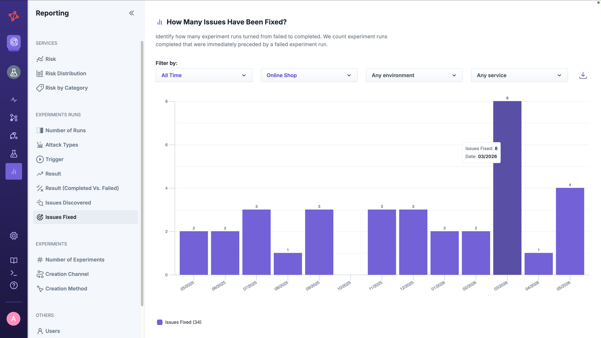

## Experiments

The Experiments report gives you an overview of experiments that have been designed in your environment — how many designs exist, what channels teams use to create them, and which methods (from scratch, template, or advice) they prefer.
Useful for tracking the spread of experiment authoring across the organization.

You can filter the report by the following criteria:

* Timeframe
* Teams
* Environments

### Number of Experiments

Find out how many experiments your teams have designed in total.

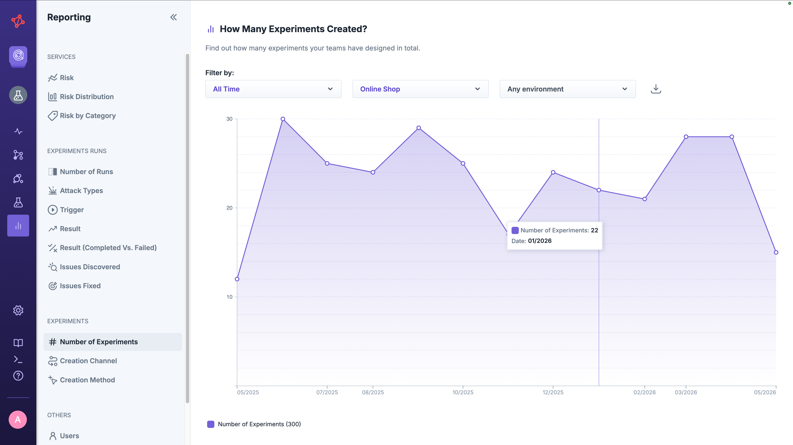

### Creation Channel

Identify which channel is used the most across your teams to create an experiment: UI, API, or CLI

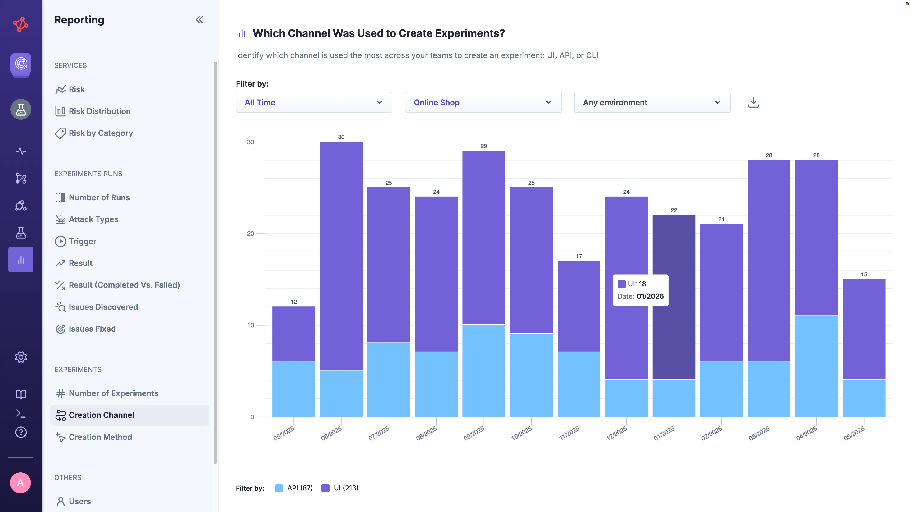

### Creation Method

Identify which method is used the most across your teams to create an experiment: From scratch, template, or advice

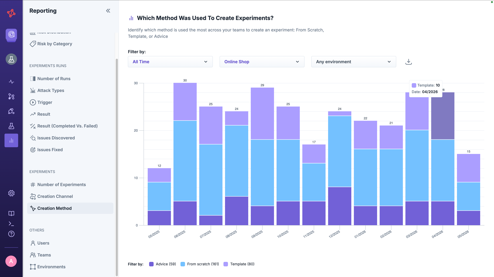

## Others

These reports give you an overview of the adoption of Steadybit across your organization.

You can filter the reports by timeframe.

### Users

Identify the progress you have made to roll out Steadybit in your organization by seeing the number of invited users.

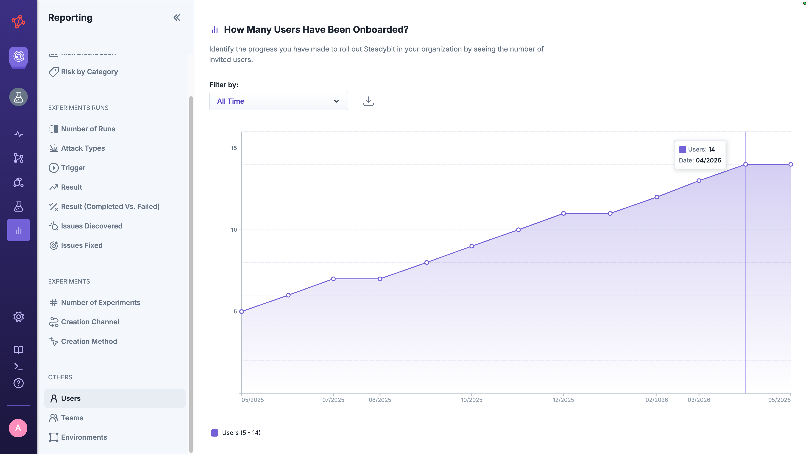

### Teams

Easily report on the numbers of teams having access to a safe Chaos Engineering in your organization.

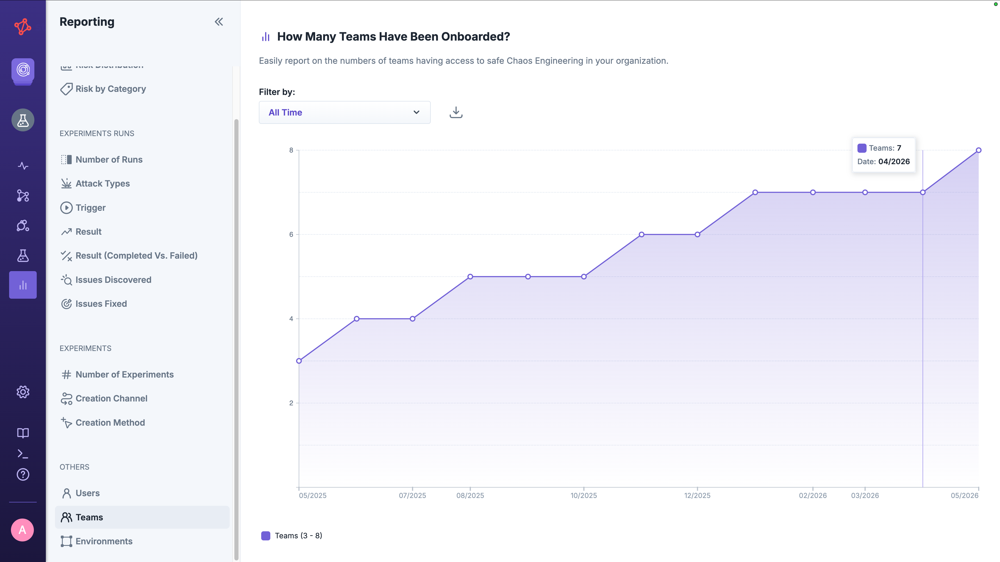

### Environments

Find out how many environments you have created to roll out a safe Chaos Engineering across your organization.

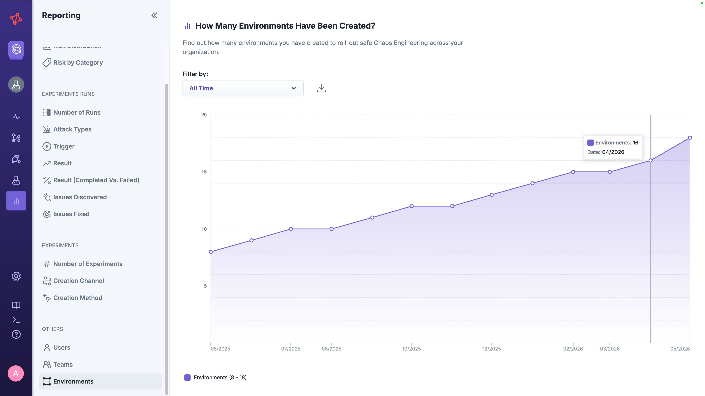
