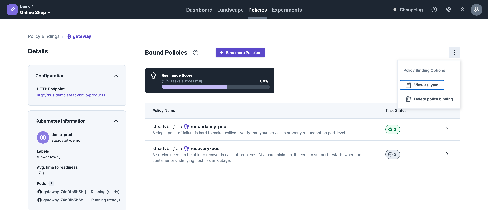
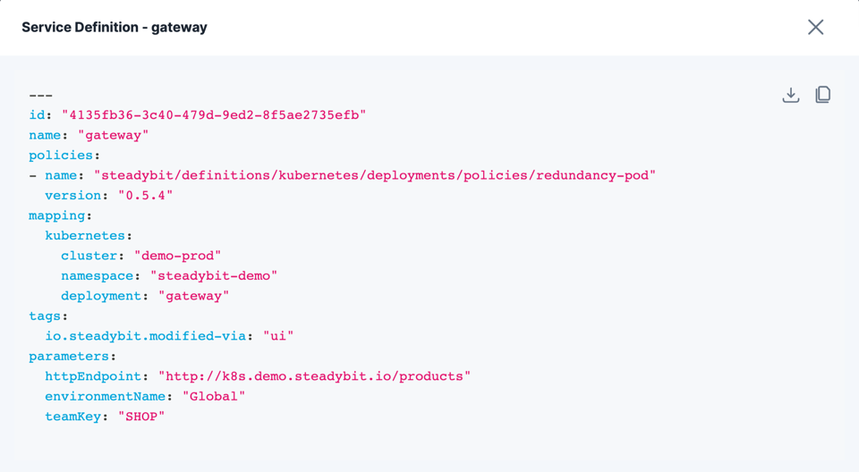

# YML download/import

You are able to download and import policy YML files from the UI.

For that you have to navigate to the policy via the landscape -> Resilience Score.

Then you can click on the `See more details` button.

## Download

On the Service Details page you are able to download the YML file via the 3 dotted button .

You can download the YML file of the policy in the popup.

## Import
