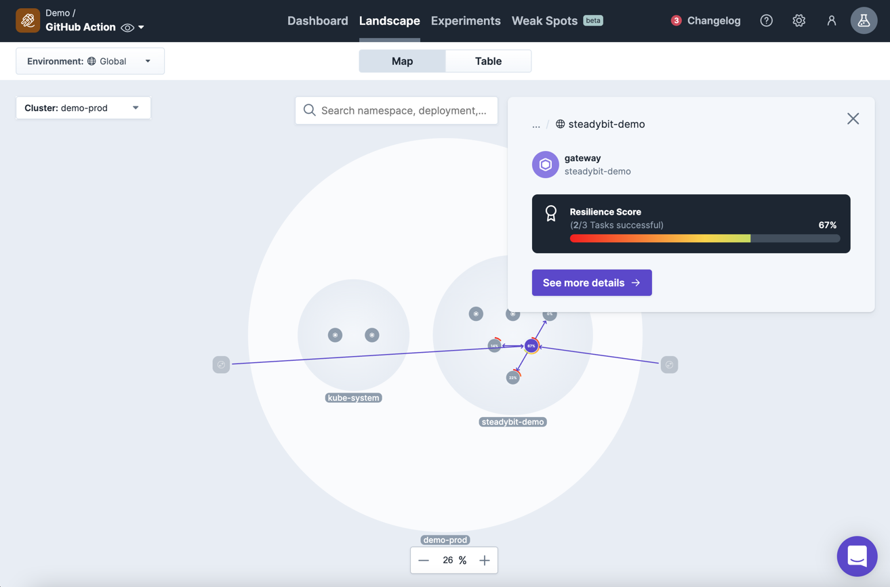

# YML download/import

You are able to download and import policy YML files from the UI.

For that you have to navigate to the policy via the landscape -> Resilience Score.

Then you can click on the `See more details` button.
## download

## import
