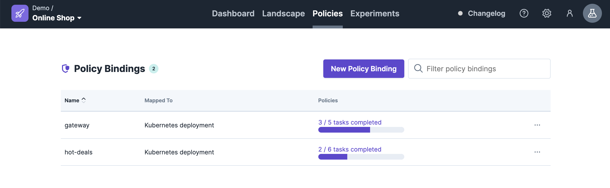

# Policy via YML

You are able to download policy YML files from the UI.

For that you have to navigate to the policy via the policy list view.

You can open the policy details by clicking on an item in the list.

## Download

On the Policy Details page you are able to download the YML file via the 3 dotted button .

You can download the YML file of the policy in the popup.

## Import

When you have a service definition you can edit and import it via our CLI via `steadybit policy-binding apply`

see also:

* [Github](https://github.com/steadybit/cli)
* [CLI](broken-reference)
