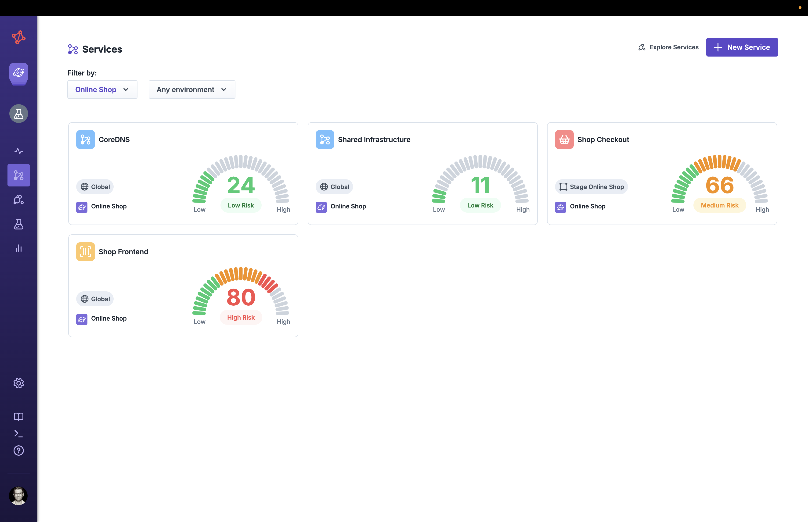
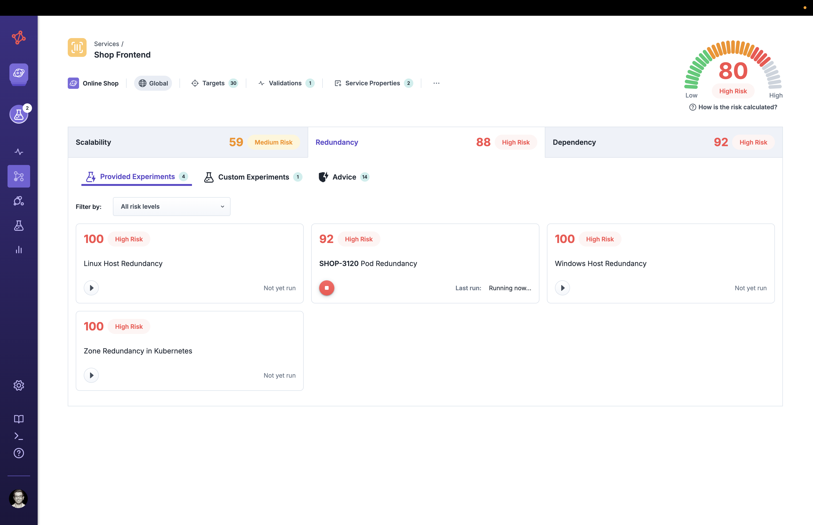
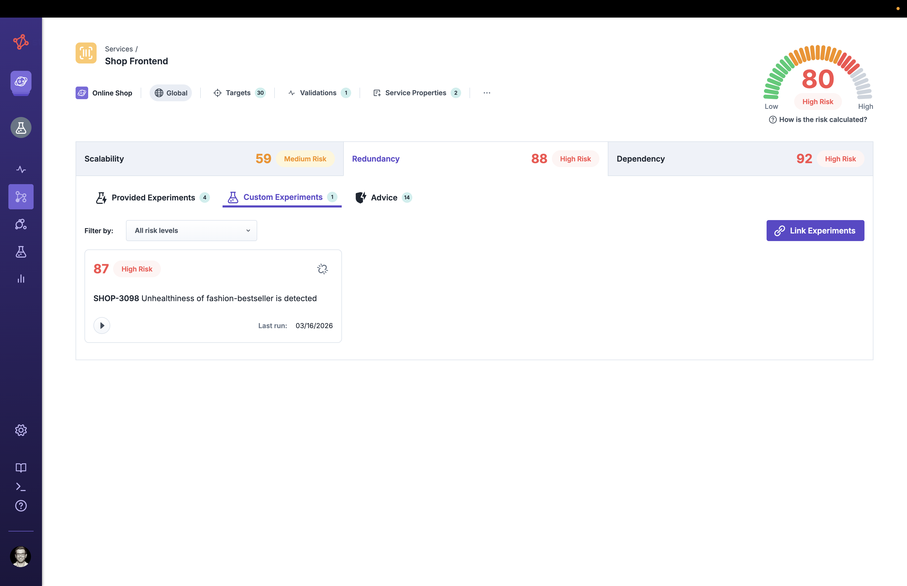
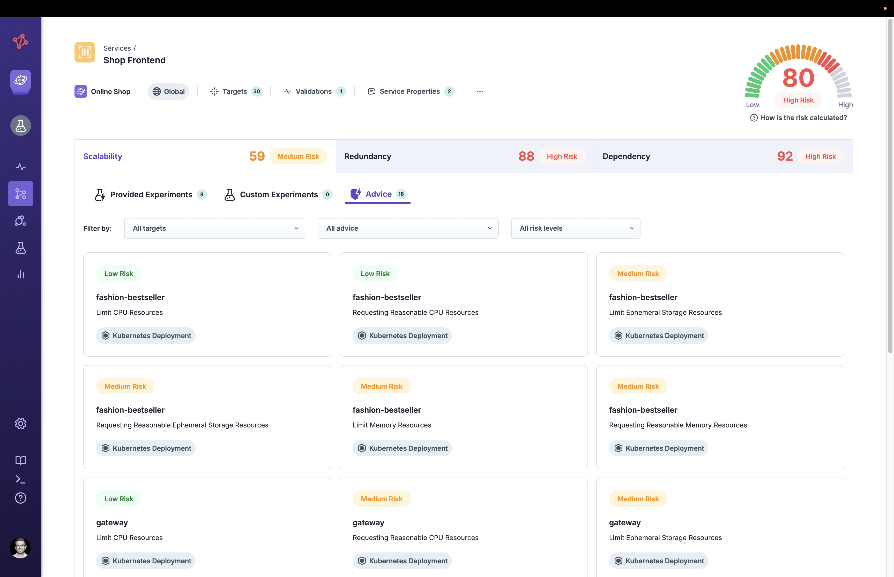
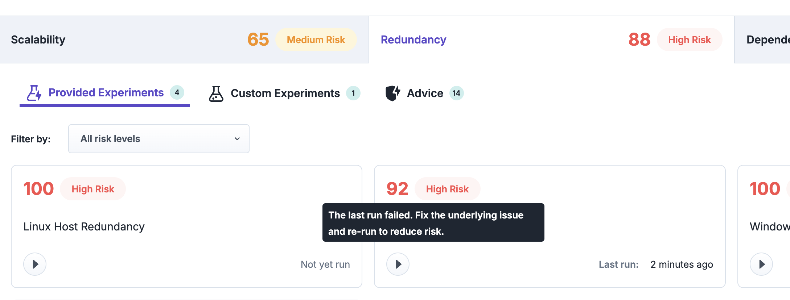
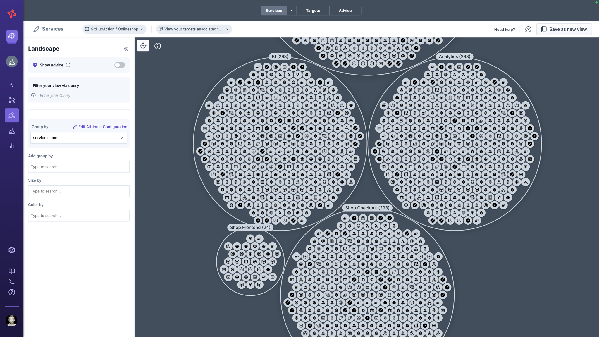
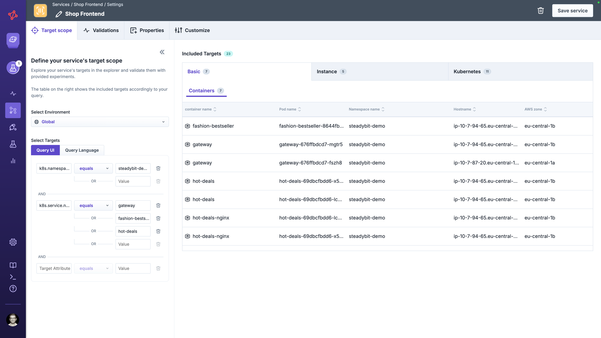
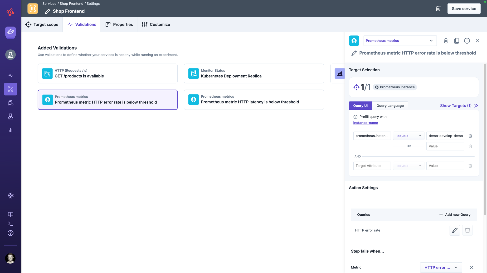
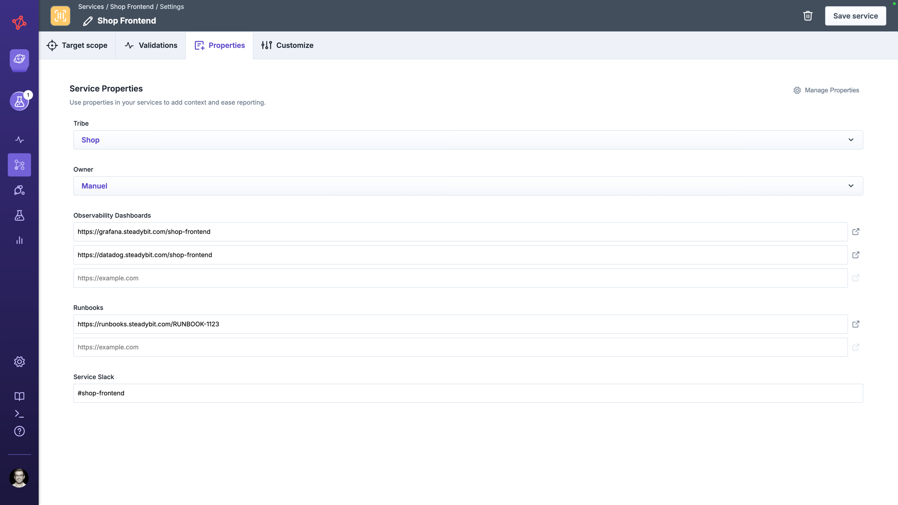
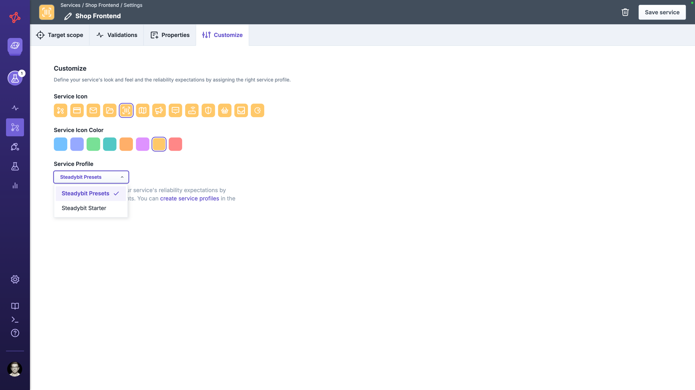

# Services

Services bring everything a team needs for reliability into one place.
Instead of managing scattered experiments, validations, and reports separately, a service gives you a single view of a specific application or system component — covering which targets belong to it, how to validate its health, and experiments evaluating its reliability.

## What Makes Up a Service

A service is defined by three core elements:

- **Target Scope** — the environment and query that resolve the targets belonging to this service (e.g., all Kubernetes resources of a Kubernetes service, a set of Virtual Machines, or cloud managed services)
- **Validations** — checks or load tests (HTTP, Datadog, Dynatrace, Prometheus, k6, and more) that define what 'healthy' means for this service while an experiment runs. Refer to our [Reliability Hub](https://hub.steadybit.com/?kind=CHECK%2CLOAD_TEST) for a complete list of available actions
- **Properties** — optional custom metadata to categorize and describe a service (e.g. business criticality, service owner)

A service always fulfills a **service profile**, which defines the set of experiment templates that the service is expected to fulfill for reliability.
[Learn more how to manage and set up a custom service profile](../../install-and-configure/manage-service-profiles/README.md).

## Service Detail

Once a service is set up, its detail view gives you three tabs: _Provided Experiments_, _Custom Experiments_, and _Advice_.

The header bar always shows you a quick summary of the service — its linked environment, the number of resolved targets, active validations, any service properties, and the current [risk score](#risk).

### Provided Experiments

Provided experiments are automatically generated from the linked service profile.
Each experiment template in the profile is instantiated with your service's targets and validations, giving you ready-to-run experiments without manual setup.

Experiments are grouped by the categories defined in the service profile (e.g., Scalability, Redundancy, Dependencies).
Each card shows the experiment name, its last run status, and a quick-run button.
You can filter the list by category using the filter pills at the top.

The generated experiments use your service's targets and validations directly — for example, the **Pod Redundancy** experiment is created as `SHOP-3073 Pod Redundancy` and scoped to the exact pods in your service's target scope.

### Custom Experiments

Beyond provided experiments, you can link any existing experiment to the service to keep all relevant reliability work in one place.

Click **Link Experiments** to associate one or more existing experiments with the service.
Linked experiments appear alongside the provided experiments, giving your team a complete picture of all reliability validation for this service.

You can use the `Service Validation` step inside a custom experiment, to reuse service's validations or use other actions (e.g. checks, or load tests) to validate your infrastructure's behavior.

### Advice

The **advice** tab surfaces reliability recommendations for the targets within your service's scope.
Each advice item is categorized (e.g., Scalability, Redundancy) and indicates its current state — making it easy to identify gaps and prioritize improvements.

Advice is generated based on the discovered targets and [installed advice-supported extensions](https://hub.steadybit.com/extensions?tags=Advice) in your service's scope.
[Learn more about advice](../explorer/advice.md).

## Risk

Every service has a **risk** associated to give you a quick indicator of its reliability posture.

The risk is calculated per category defined in the service profile (e.g., Scalability, Redundancy, Dependencies), and the overall service risk is a rollup across those categories.
You can see both the overall score and the per-category breakdown in the header of the service detail page, and open **How is the risk calculated?** for a detailed explanation in the product.

The higher the score, the higher the risk: 100 indicates the highest risk, where as 10 is the lowest achievable risk.
The risk never reaches zero, because reliability is a continuous effort: the service always needs ongoing validation to stay trustworthy.

### How to Reduce the Risk

The following factors reduce the risk of a service:

- **Successful experiment runs** — each linked experiment (both [provided](#provided-experiments) and [custom](#custom-experiments)) that finishes with state `COMPLETED` lowers the risk. Failed, errored, or never-executed experiments keep the risk high.
- **Recent runs** — the score reflects how recently experiments were executed. Re-run your experiments at least every 30 days; the older the last run, the more the risk drifts back up.
- **Strong validation coverage** — service validations, and additional checks and load tests inside your experiments increase confidence.
- **Resolved advice** — working through items on the [Advice](#advice) tab reduces the risk of the affected category. An advice requiring action is associated with a high risk (`100`), whereas a required validation is a medium risk (`50`), and an implement advice results in low risk (`10`).  

The product surfaces inline guidance next to each experiment and category, showing you the most impactful next steps to lower the risk.

### Comparing Services

The risk score is also surfaced outside of the service detail page so you can spot where to invest next:

- In the **Services** overview, each service shows its current score — making it easy to compare the reliability posture of different services at a glance.
- On each team's **Dashboard**, the top-risk services are highlighted so owners can prioritize their reliability work.

## Exploring Services

You can explore the targets of a service directly from two entry points:

- **Services overview** — click **Explore Services** to open the Explorer with all targets across all services.
- **Service detail** — click **Explore Targets** in the top-right corner to open the Explorer scoped to the targets of that specific service.

In the Explorer, you can group and filter targets by any attribute — for example, by Kubernetes labels, AWS zone, or deployment — to understand how your service's infrastructure is distributed and identify potential reliability gaps.

Every target that belongs to a service is enriched with two additional attributes:

- `service.id` — the unique identifier of the service
- `service.name` — the name of the service

These attributes are available throughout Steadybit: use them in the Explorer to filter or group by service, and in experiment design to target specific services or reference them in queries.
[Learn more about Explorer's capabilities](/use-steadybit/explorer/).

## Managing Services

Create a new service via **Services** → **New Service** and configure it through four tabs: _Target Scope_, _Validations_, _Properties_, and _Customize_.
A service can be created and edited by administrator or team owners.
A team member can instantiate and run experiments, link custom experiment or validate advice.

### Target Scope

The target scope determines which infrastructure targets belong to this service.
You select an [environment](../../install-and-configure/manage-environments) to restrict available infrastructure components, and then use a **query** (either Query UI or [Query Language](../../concepts/query-language)) to filter targets precisely.

The right panel shows all included targets matching your query, grouped by target type (e.g., Containers, Hosts, or Kubernetes resources).
This gives you immediate feedback on which infrastructure components are in scope before saving.

Target scope will be used when configuring validations (see next chapter), running experiments and can be explored via [explorer](/use-steadybit/explorer/).

### Validations

Validations define whether your service is healthy during an experiment.
They are used as the steady-state checks in provided experiments.

Click **Add Validation** to pick from available actions of type `check` or `load test`.
Common validations include:

- HTTP checks
- Observability monitors (e.g. Datadog, Dynatrace, Prometheus metrics)
- Load tests (e.g. k6, JMeter, Gatling)
- Any other validation tools (e.g. Cypress UI Tests) via Jenkins jobs

Refer to our [Reliability Hub](https://hub.steadybit.com/?kind=CHECK%2CLOAD_TEST) for a complete list of available actions

### Properties

Custom properties let you attach metadata to a service — for example, service ownership, business criticality, or links to runbooks.
Properties are defined globally and can be managed in [Manage Properties](../../install-and-configure/manage-properties/README.md#manage-property-definitions).
You can associate properties [to all services via settings](/install-and-configure/manage-properties/README.md#assign-properties) or to [individual services](/install-and-configure/manage-properties/README.md#assign-properties-individually).

### Customize

Additionally, you can change the look and feel of your service by customizing the used icon and icon color.
More importantly, you can change the service profile of a service - defining a different set of experiment templates used to provide experiments.
Thus, adhering to different reliability expectations.


Be aware, that changing a service's service profile results in deleting provided experiments and experiment runs that aren't part of the newly associated profile anymore.


## Service Profiles

Every service is linked to a service profile that defines which experiment categories and templates are provided.
Steadybit ships with a default Starter profiles — a focused set of experiments to get started with reliability testing quickly.

Administrators can create custom service profiles tailored to organizational standards, which is highly recommended when rolling out Steadybit.
See [Manage Service Profiles](../../install-and-configure/manage-service-profiles/README.md) for details.