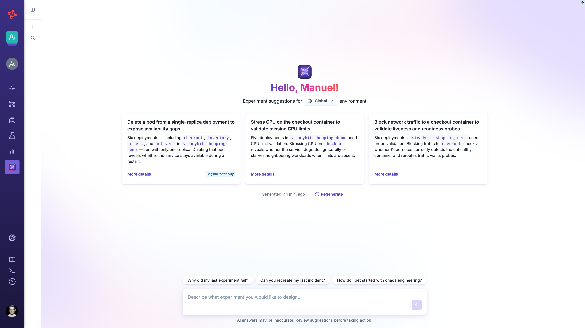
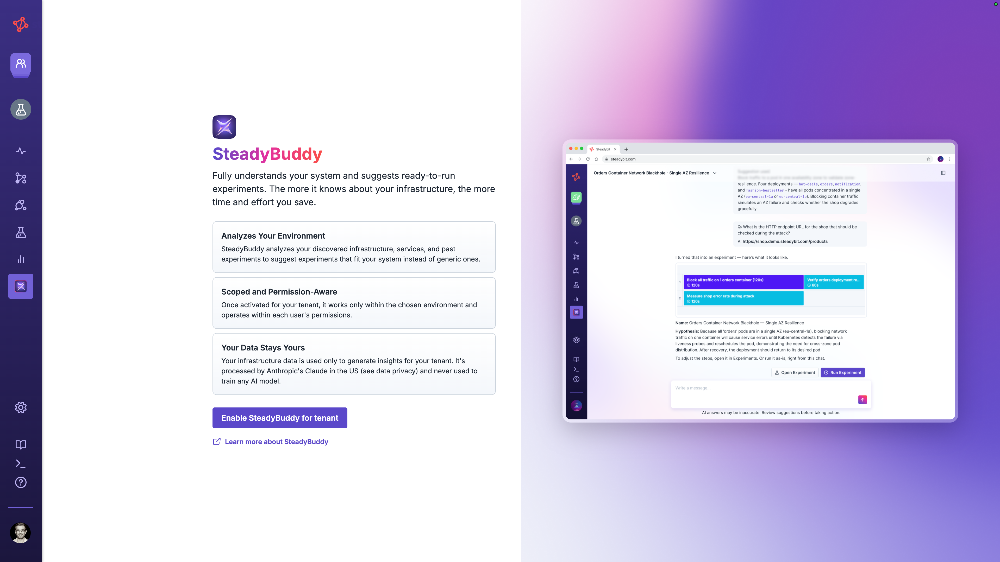
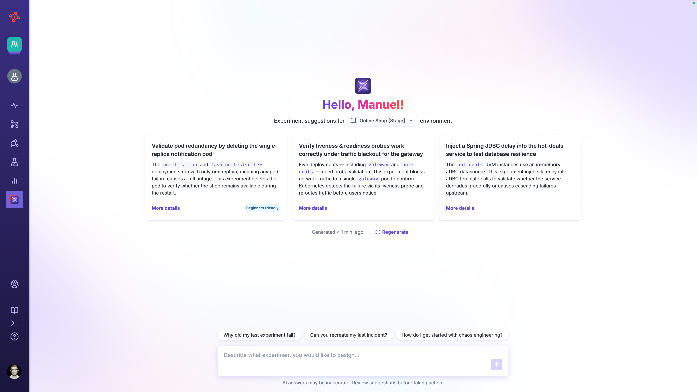
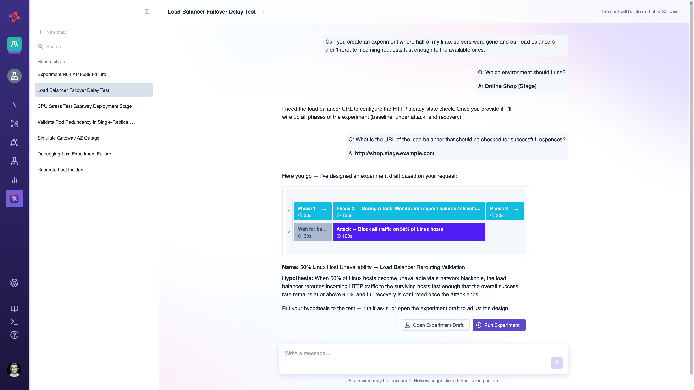
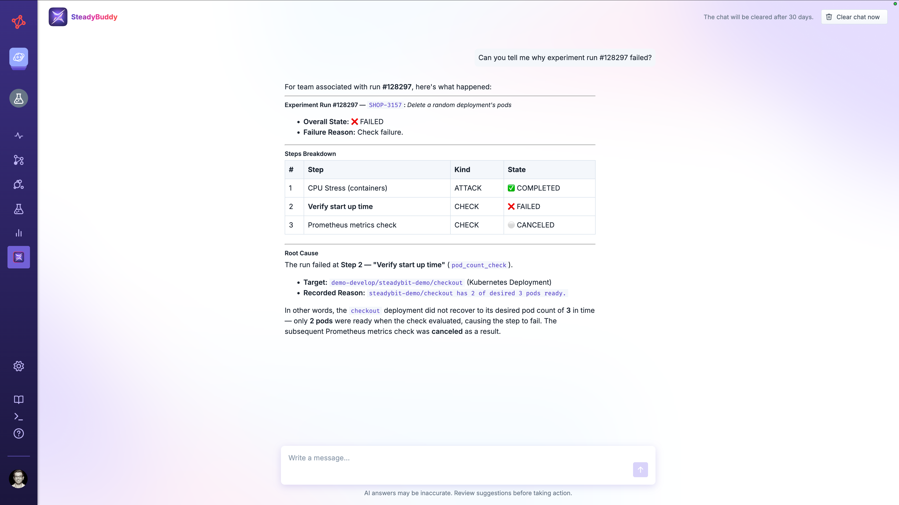

# SteadyBuddy


**SteadyBuddy is part of Steadybit Labs** and is currently only available upon request.
[Learn more](https://steadybit.com/blog/introducing-steadybit-labs-help-shape-the-future-of-reliability-testing/)


SteadyBuddy is Steadybit's AI-powered assistant built into the platform that helps you design, run, and understand chaos experiments using natural language.
Instead of clicking through the experiment editor, you can describe what you want to test, ask why an experiment failed, or let SteadyBuddy propose ready-to-run experiments tailored to your environment.

## How SteadyBuddy Works

SteadyBuddy acts **on your behalf** and only sees what you are allowed to see.
Every question, suggestion, and experiment draft is scoped to:

- **Your team** — only the actions, environments, and targets available to your currently selected team are used as context.
- **Your permissions** — SteadyBuddy reads the same data you can read in the UI/API. It cannot surface targets, environments, or runs you have no access to.


**SteadyBuddy never performs destructive operations on its own.**
Today, it performs **read-only** operations: it reads your actions, environments, targets, advice, and experiment runs to answer questions and to draft experiments.
It does not create, modify, or delete anything without an explicit, human-initiated action — for example, you clicking a button in the UI.

As the assistant gains the ability to take more actions on your behalf, we will add additional safeguards around potentially destructive operations.


## Availability and Setup

How SteadyBuddy is enabled depends on whether you use the Steadybit SaaS platform or run Steadybit on-prem.

### SaaS — Opt In

For SaaS customers, SteadyBuddy is **off by default** and must be explicitly enabled by a tenant administrator.
This is an opt-in step because chat and suggestions are processed by an external model provider (see [Data Processing and Privacy](#data-processing-and-privacy)).

To enable SteadyBuddy, access it from the navigation or go to **Settings → Data & Access**.
Once enabled, every user within your tenant can start using SteadyBuddy.

If you are not an administrator, ask one of your tenant admins to enable it for you.

### On-Prem — Configure a Provider

For self-hosted (on-prem) installations, there is no separate opt-in: SteadyBuddy is available once you configure a model provider in the platform's environment variables and the AI capability is part of your license.
On-prem deployments run against your own AI provider.

See [configuration options / AI](../../install-and-configure/install-on-prem-platform/advanced-configuration.md#steadybuddy) for the provider, model, and retention settings.

## Data Processing and Privacy

SteadyBuddy only sends the context needed to answer your request.
Depending on what you do, this can include: your typed messages, the names and metadata of actions and environments available to your team, target type and attribute summaries for the selected environment, reliability advice, and experiment run results.
It never sends credentials or secrets.


**SaaS:** SteadyBuddy uses **Anthropic** models.
Your data is **not used to train any models** — this is covered by our [data privacy terms](https://steadybit.com/imprint/).


**On-prem:** processing happens through your own chosen AI provider.
No data ever leaves your infrastructure — neither to a Steadybit-hosted service nor to any other AI provider.

Chat history is retained for a limited time (30 days by default) and can be cleared at any time with **Clear chat now**.
On-prem, retention periods are [configurable](../../install-and-configure/install-on-prem-platform/advanced-configuration.md#steadybuddy).

## What You Can Do

### Get Experiment Suggestions

Pick an environment and SteadyBuddy analyzes the targets it contains to propose ready-to-run experiment ideas tailored to what it finds.
Each suggestion comes with a short description and a **More details** view; from there you can **Build experiment** to open it in the editor.

Use this when you are getting started in a new environment, or need guidance on what to test next.

Experiment suggestions use the same flow described in [the following section](#create-experiments-from-scratch-via-chat).

### Create Experiments from Scratch via Chat

Describe the experiment you want in your own words — for example, *"Test how my checkout service behaves when one of its pods is killed"*.
SteadyBuddy asks clarifying questions when needed, then produces an experiment draft.
You can:

- **Open Experiment Draft** to review and edit it in the experiment editor, or
- **Run Experiment** to execute it immediately.

The draft is scoped to your selected environment and uses only actions and targets your team can access.

The experiment draft must be saved manually before it appears in the Experiments section or can be run later.

### Analyze an Experiment Run

Ask questions like *"Why did my last experiment fail?"*.
SteadyBuddy reads the relevant run data and explains what happened, grounding its answer in the actual execution results rather than guessing.

### Usage Limits

AI usage is subject to a budget tied to your plan.
When the budget for the current period is reached, the chat and suggestions are not available anymore.
Please [contact us](https://steadybit.com/contact-us/) to enable AI features again.
