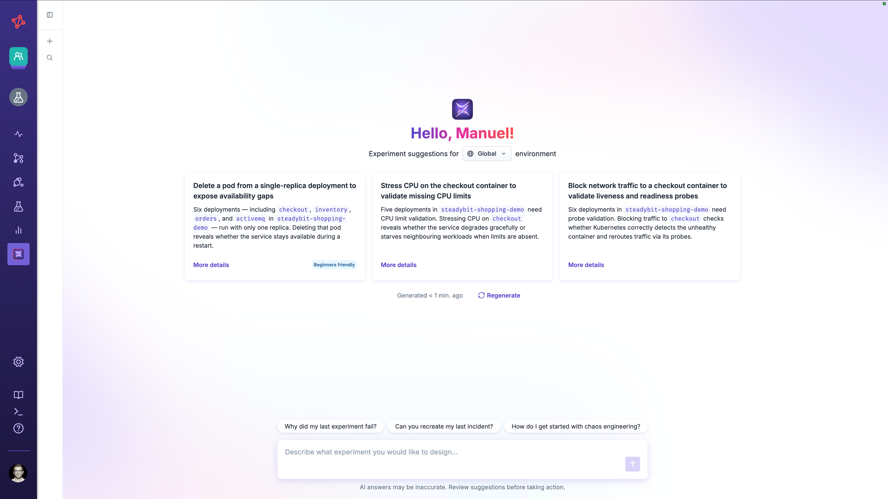
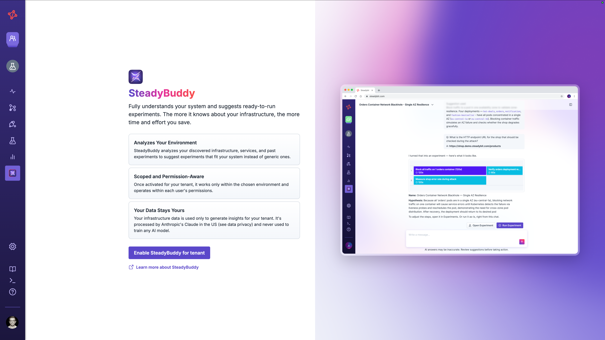
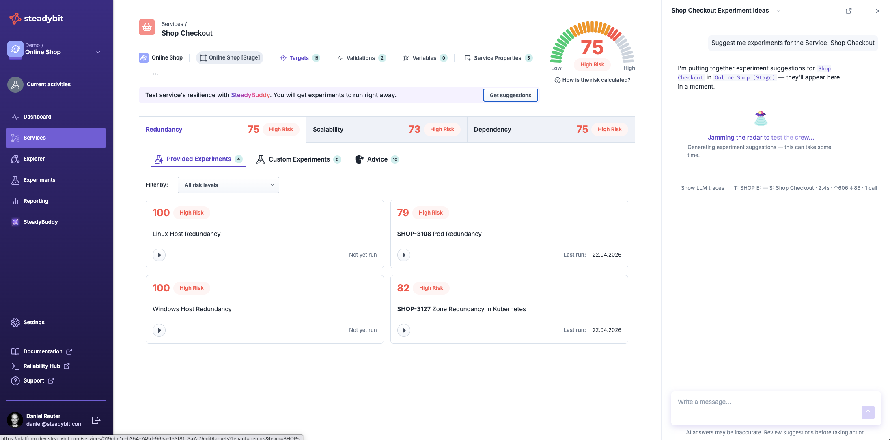
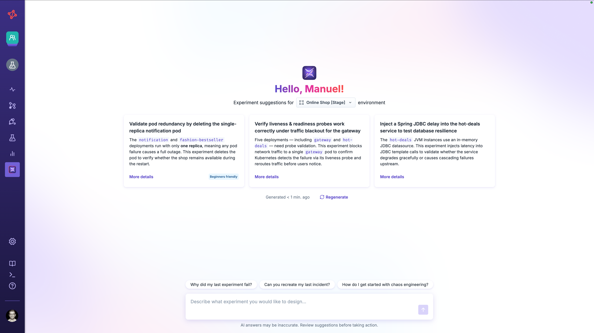
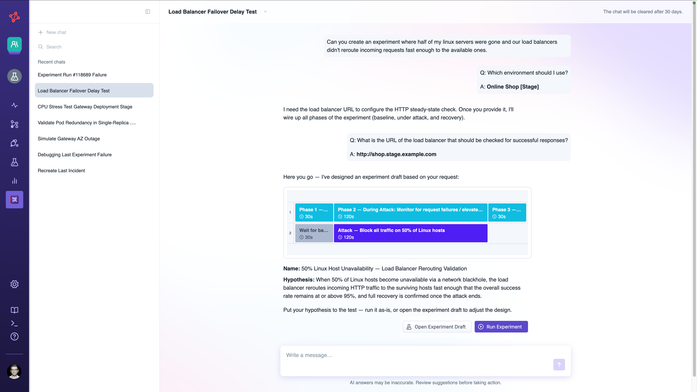
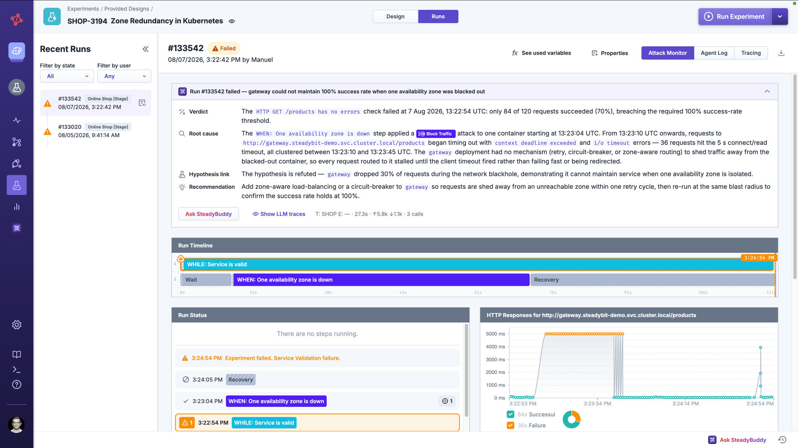
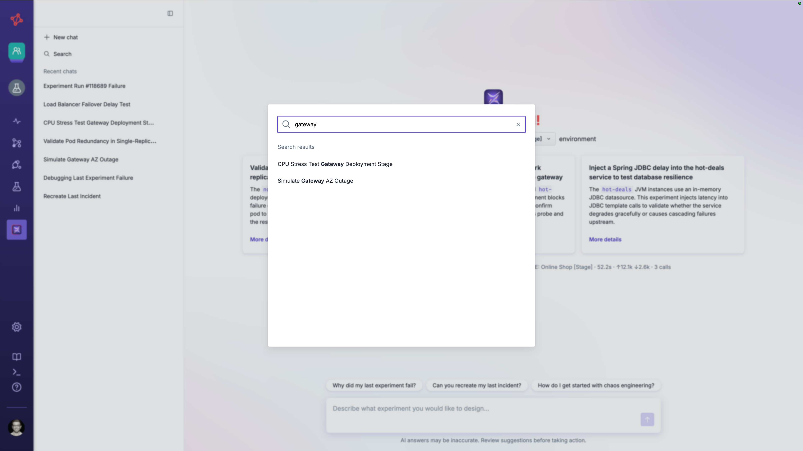

# SteadyBuddy


**SteadyBuddy is part of Steadybit Labs** and is currently only available upon request.
[Learn more](https://steadybit.com/blog/introducing-steadybit-labs-help-shape-the-future-of-reliability-testing/)


SteadyBuddy is Steadybit's AI-powered assistant built into the platform that helps you design, run, and understand chaos experiments using natural language.
Instead of clicking through the experiment editor, you can describe what you want to test, ask why an experiment failed, or let SteadyBuddy propose ready-to-run experiments tailored to your environment.

## How SteadyBuddy Works

SteadyBuddy acts **on your behalf** and only sees what you are allowed to see.
Every question, suggestion, and experiment draft is scoped to:

- **Your team** — only the actions, environments, and targets available to your currently selected team are used as context.
- **Your permissions** — SteadyBuddy reads the same data you can read in the UI/API. It cannot surface targets, environments, or runs you have no access to.


**SteadyBuddy never performs destructive operations on its own.**
Today, it performs **read-only** operations: it reads your actions, environments, targets, advice, and experiment runs to answer questions and to draft experiments.
It does not create, modify, or delete anything without an explicit, human-initiated action — for example, you clicking a button in the UI.

As the assistant gains the ability to take more actions on your behalf, we will add additional safeguards around potentially destructive operations.


## Availability and Setup

How SteadyBuddy is enabled depends on whether you use the Steadybit SaaS platform or run Steadybit on-prem.

### SaaS — Opt In

For SaaS customers, SteadyBuddy is **off by default** and must be explicitly enabled by a tenant administrator.
This is an opt-in step because chat and suggestions are processed by an external model provider (see [Data Processing and Privacy](#data-processing-and-privacy)).

To enable SteadyBuddy, access it from the navigation or go to **Settings → Data & Access**.
Once enabled, every user within your tenant can start using SteadyBuddy.

If you are not an administrator, ask one of your tenant admins to enable it for you.

### On-Prem — Configure a Provider

For self-hosted (on-prem) installations, there is no separate opt-in: SteadyBuddy is available once you configure a model provider in the platform's environment variables and the AI capability is part of your license.
On-prem deployments run against your own AI provider.

See [configuration options / AI](../../install-and-configure/install-on-prem-platform/advanced-configuration.md#steadybuddy) for the provider, model, and retention settings.

## Where to Use SteadyBuddy

There are two ways to talk to SteadyBuddy:

- **The SteadyBuddy sidebar** — available on every page via **Ask SteadyBuddy** at the bottom of the screen. It stays open while you navigate, so you can keep a conversation running next to whatever you are looking at.
- **The SteadyBuddy page** — open it from the navigation for a full-width chat. Use this when the assistant is your starting point rather than your companion.

Some pages give the conversation a context to work with, shown as a pill above the message box:

| Page                  | What SteadyBuddy knows          |
|-----------------------|---------------------------------|
| An experiment run     | The run and its experiment      |
| An experiment design  | The experiment being designed   |
| A service's detail    | The service                     |

With a context in place you can just ask *"Why did this fail?"* without naming the run. Remove the pill if you want to ask something unrelated.

**Ask SteadyBuddy** always starts a new conversation. To continue an earlier one, use the chat history in the sidebar's bottom bar, or open the SteadyBuddy page.

## Data Processing and Privacy

SteadyBuddy only sends the context needed to answer your request.
Depending on what you do, this can include: your typed messages, the names and metadata of actions and environments available to your team, target type and attribute summaries for the selected environment, reliability advice, and experiment run results.
It never sends credentials or secrets.


**SaaS:** SteadyBuddy uses **Anthropic** models.
Your data is **not used to train any models** — this is covered by our [data privacy terms](https://steadybit.com/imprint/).


**On-prem:** processing happens through your own chosen AI provider.
No data ever leaves your infrastructure — neither to a Steadybit-hosted service nor to any other AI provider.

Chat history is retained for a limited time (30 days by default), and you can [delete any individual chat](#work-with-your-chat-history) at any time.
On-prem, retention periods are [configurable](../../install-and-configure/install-on-prem-platform/advanced-configuration.md#steadybuddy).

## What You Can Do

### Get Experiment Suggestions

Ask SteadyBuddy what to test and it analyzes the targets it finds to propose ready-to-run experiment ideas.
Each suggestion comes with a short description and a **More details** view; from there you can **Build experiment** to open it in the editor.

Use this when you are getting started in a new environment or with a new service, or need guidance on what to test next.

You can scope suggestions in two ways:

**For an environment** — on the SteadyBuddy page, pick an environment and SteadyBuddy proposes experiments for the targets it contains.

**For a service** — on a [service's detail page](../services/README.md#service-detail), use **Get suggestions** in the SteadyBuddy banner (or **Suggest experiments for this service** in the sidebar).
The suggestions are scoped to that service's targets and its environment, and appear in the sidebar next to the service, so you can compare them against the service's existing [provided](../services/README.md#provided-experiments) and [custom experiments](../services/README.md#custom-experiments) without leaving the page.

Experiment suggestions use the same flow described in [the following section](#create-experiments-from-scratch-via-chat).

### Create Experiments from Scratch via Chat

Describe the experiment you want in your own words — for example, *"Test how my checkout service behaves when one of its pods is killed"*.
SteadyBuddy asks clarifying questions when needed, then produces an experiment draft.
You can:

- **Open Experiment Draft** to review and edit it in the experiment editor, or
- **Run Experiment** to execute it immediately.

The draft is scoped to your selected environment and uses only actions and targets your team can access.

The experiment draft must be saved manually before it appears in the Experiments section or can be run later.

### Analyze an Experiment Run

The [run view](../experiments/run.md#run-view) shows you *what* happened — every step, target, timing, metric and log line.
SteadyBuddy's run analysis adds the *why*.

When a run fails or errors, the run page offers to explain it. One click and SteadyBuddy reads the actual execution results and answers in a fixed, scannable shape:

- **Verdict** — one sentence: what failed, and at which check.
- **Root cause** — the causal chain: for a **failure**, why your system's reliability fell short of your expectations; for an **error**, why Steadybit itself couldn't run an action.
- **Hypothesis** — if the experiment carries a hypothesis, a judgement on whether it held.
- **Recommendation** — one concrete step to improve your system's reliability: the fix to apply, plus a re-run at the same blast radius to confirm it.

A few things worth knowing:

- The analysis is **computed once per run and stored with it**. Reopening the run — or a colleague opening it — shows the same analysis, and asking for it again in the chat reuses the existing one instead of producing a second opinion.
- Analysis runs in the background. Everyone with the run open sees it appear without refreshing.
- You can collapse the panel; that choice is remembered for that run.
- Runs that passed or were canceled do not advertise an analysis, but you can still ask for one in the chat.

You can also ask in your own words — *"Why did my last experiment fail?"* — either in the sidebar on the run itself or on the SteadyBuddy page.

### Work With Your Chat History

SteadyBuddy keeps a history of your past conversations.
On the SteadyBuddy page it lives in a collapsible panel on the left — use the panel toggle to show or hide it, and **New chat** to start a fresh conversation at any time.
In the [sidebar](#where-to-use-steadybuddy), the same history is reachable from the bottom bar.

Your previous conversations appear under **Recent chats**. From there you can:

- **Open** any past chat to continue where you left off.
- **Rename** a chat to give it a more descriptive title — hover over an entry and open its **⋯** menu, then choose **Rename**.
- **Delete chat** from the same **⋯** menu to remove a conversation you no longer need.
- **Search** across your chats to quickly find a specific conversation by its title.

Your chat history is scoped to you and your currently selected team, and follows the same [retention rules](#data-processing-and-privacy) as the rest of SteadyBuddy.

### Usage Limits

AI usage is subject to a budget tied to your plan.
When the budget for the current period is reached, the chat and suggestions are not available anymore.
Please [contact us](https://steadybit.com/contact-us/) to enable AI features again.
